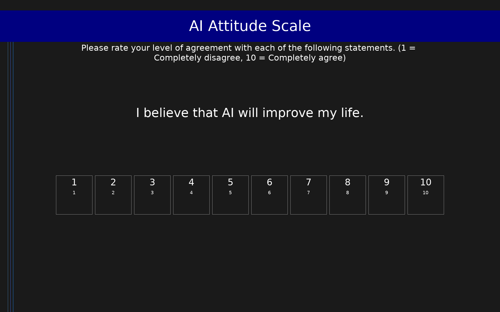

# AI Attitude Scale (AIAS-4)

4-item measure of general attitude toward artificial intelligence, covering perceived usefulness, adoption intention, and societal impact. Scores range from 1 to 10.

## Overview

- **Code:** `AIAS4`
- **Items:** 0
- **Languages:** en
- **Version:** 1.0
- **License:** CC BY 4.0

## Dimensions

| ID | Name | Description |
|----|------|-------------|
| `attitude` | AI Attitude | Overall attitude toward artificial intelligence. Higher scores indicate more positive attitudes. |

## Questions

## Scoring

- **attitude**: mean_coded (4 items)
  - Mean of all 4 items (1-10 scale). Higher scores indicate more positive attitudes toward AI.

## Citation

Grassini, S. (2023). Development and validation of the AI attitude scale (AIAS-4): A brief measure of general attitude toward artificial intelligence. Frontiers in Psychology, 14, 1191628. https://doi.org/10.3389/fpsyg.2023.1191628

**URL:** https://doi.org/10.3389/fpsyg.2023.1191628

## Files

- `AIAS4.en.json`
- `AIAS4.json`
- `screenshot.png`

---
*This README was auto-generated by `tools/generate_readmes.py`.*
