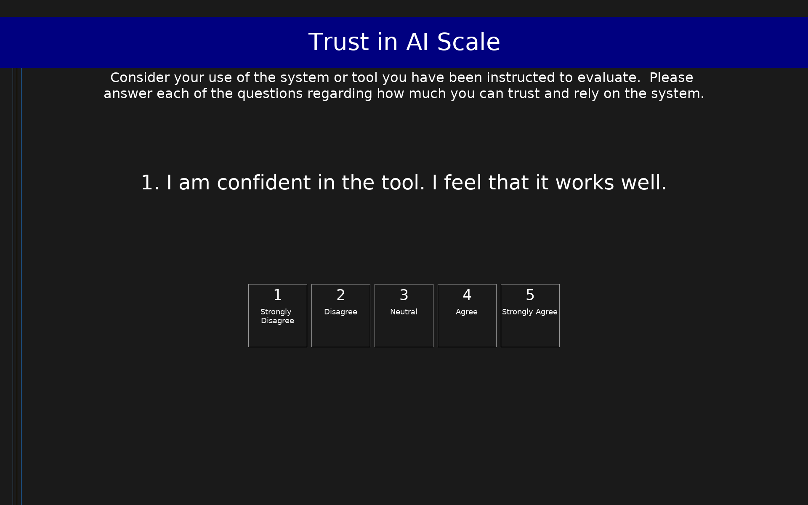

# Trust in AI Scale (Trust in the AI/XAI Context)

8-item scale measuring user assessments of trust in AI systems, with reverse-coded wary item.

## Overview

- **Code:** `AITrust`
- **Items:** 0
- **Languages:** en
- **Version:** 1.0
- **License:** CC

## Dimensions

| ID | Name | Description |
|----|------|-------------|
| `Trust_In_AI` | Trust in AI | Mean trust in AI score, with appropriate reverse coding of negatively-posed questions. |

## Questions

## Scoring

- **Trust_In_AI**: mean_coded (8 items)

## Citation

Hoffman, R. R., Mueller, S. T., Klein, G., & Litman, J. (2023). Measures for explainable AI: Explanation goodness, user satisfaction, mental models, curiosity, trust, and human-AI performance. Frontiers in Computer Science, 5, 1096257.

**URL:** https://scholar.google.com/citations?view_op=view_citation&hl=en&user=Pi0A91kAAAAJ&citation_for_view=Pi0A91kAAAAJ:5UUbrqTvKfUC

## Files

- `AITrust.en.json`
- `AITrust.json`
- `README.md`
- `screenshot.png`

---
*This README was auto-generated by `tools/generate_readmes.py`.*
