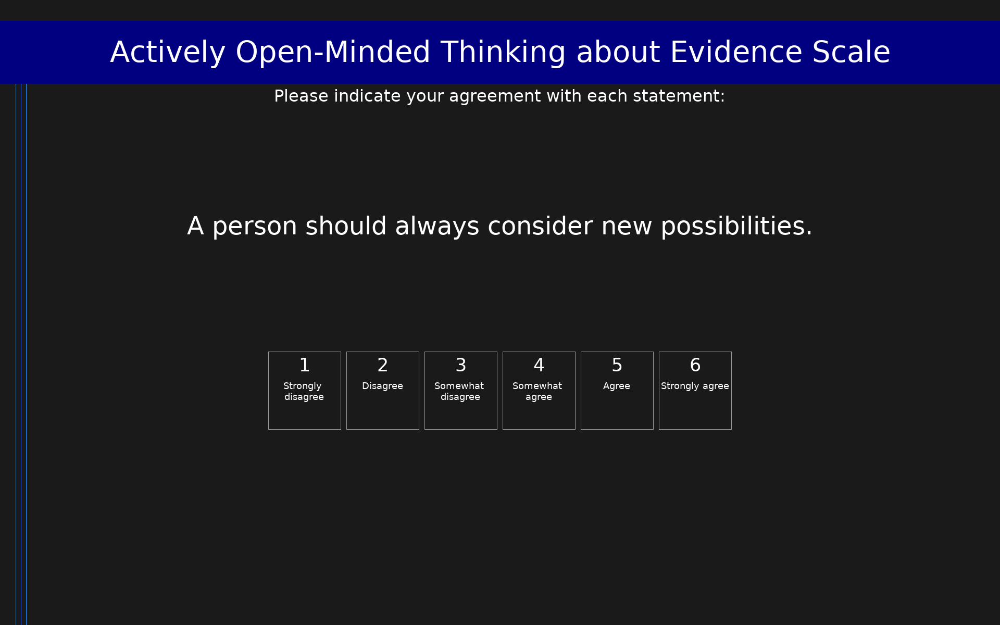

# Actively Open-Minded Thinking about Evidence Scale (AOT-E)

The Actively Open-Minded Thinking about Evidence (AOT-E) scale measures the meta-belief that one's beliefs should be revised in response to evidence. It was derived from the Stanovich and West (2007) AOT scale by Pennycook et al. (2020), who selected 8 items related to belief mutability from four AOT subscales (AOT, belief identification, dogmatism, and openness values). Participants respond on a 6-point scale from 1 (Strongly disagree) to 6 (Strongly agree). Items 3, 4, 5, 7, and 8 are reverse-scored. Higher total scores indicate more actively open-minded thinking about evidence. The scale was validated in a Brazilian sample and published in Judgment and Decision Making (Bonafé-Pontes et al., 2025).

## Overview

- **Code:** `AOTE`
- **Items:** 0
- **Languages:** en
- **Version:** 1.0
- **License:** CC BY 4.0

## Dimensions

| ID | Name | Description |
|----|------|-------------|
| `aote` | Actively Open-Minded Thinking about Evidence |  |

## Questions

## Scoring

- **aote**: mean_coded (8 items)
  - Mean of 8 items after reverse-scoring items 3, 4, 5, 7, and 8. Range 1–6. Higher scores indicate greater willingness to revise beliefs in response to evidence.

## Citation

Pennycook, G., Cheyne, J. A., Koehler, D. J., & Fugelsang, J. A. (2020). On the belief that beliefs should change according to evidence: Implications for conspiratorial, moral, paranormal, political, religious, and science beliefs. Judgment and Decision Making, 15(4), 476–498. Brazilian validation: Bonafé-Pontes, A., Costa Bastos, R., & Pilati, R. (2025). Actively Open-Minded Thinking About Evidence (AOT-E) Scale: Adaptation and evidence of validity in a Brazilian sample. Judgment and Decision Making, 20, e3.

**URL:** https://doi.org/10.1017/jdm.2024.37

## Files

- `AOTE.en.json`
- `AOTE.json`
- `screenshot.png`

---
*This README was auto-generated by `tools/generate_readmes.py`.*
