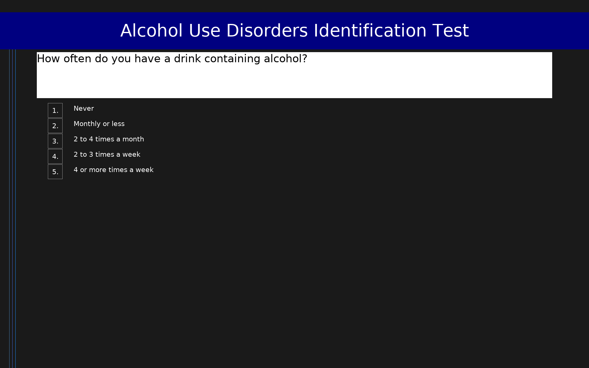

# Alcohol Use Disorders Identification Test (AUDIT)

10-item WHO screening tool for hazardous and harmful alcohol use. Scores range from 0 to 40.

## Overview

- **Code:** `AUDIT`
- **Items:** 0
- **Languages:** en
- **Version:** 1.0
- **License:** Public Domain

## Dimensions

| ID | Name | Description |
|----|------|-------------|
| `alcohol_use` | Alcohol Use |  |

## Questions

## Scoring

- **alcohol_use**: sum_coded (10 items)
  - Sum of all items (0-40). Score ≥8 = hazardous use; ≥15 = dependence likely.

## Citation

Saunders, J. B., Aasland, O. G., Babor, T. F., de la Fuente, J. R., & Grant, M. (1993). Development of the Alcohol Use Disorders Identification Test (AUDIT). Addiction, 88(6), 791-804. https://doi.org/10.1111/j.1360-0443.1993.tb02093.x

**URL:** https://www.who.int/publications/i/item/audit-the-alcohol-use-disorders-identification-test

## Files

- `AUDIT.en.json`
- `AUDIT.json`
- `README.md`
- `screenshot.png`

---
*This README was auto-generated by `tools/generate_readmes.py`.*
