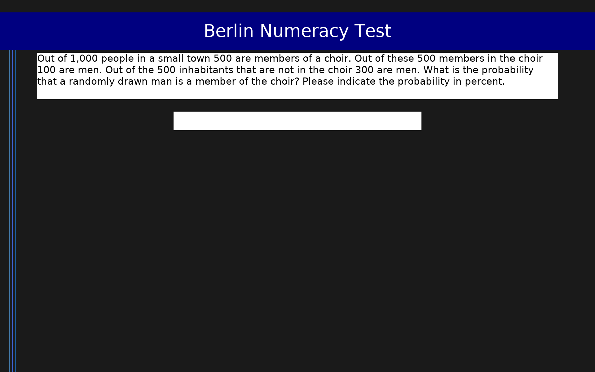

# Berlin Numeracy Test (BNT)

4-item adaptive test of statistical numeracy and risk literacy. Adaptive mode presents 2-3 questions based on correctness; non-adaptive mode presents all 4. Supports numeric free-entry or multiple-choice format.

## Overview

- **Code:** `BNT`
- **Items:** 0
- **Languages:** en
- **Version:** 1.0
- **License:** Free for research use

## Dimensions

| ID | Name | Description |
|----|------|-------------|
| `numeracy` | Statistical Numeracy |  |

## Questions

## Scoring

- **numeracy**: sum_correct (8 items)
  - Number of correct answers (0-4). Adaptive mode yields 0-3 answered, non-adaptive 0-4. Skipped items (NA) count as 0.

## Citation

Cokely, E. T., Galesic, M., Schulz, E., Ghazal, S., & Garcia-Retamero, R. (2012). Measuring risk literacy: The Berlin Numeracy Test. Judgment and Decision Making, 7(1), 25-47.

**URL:** http://www.riskliteracy.org/

## Files

- `BNT.en.json`
- `BNT.json`
- `screenshot.png`

---
*This README was auto-generated by `tools/generate_readmes.py`.*
