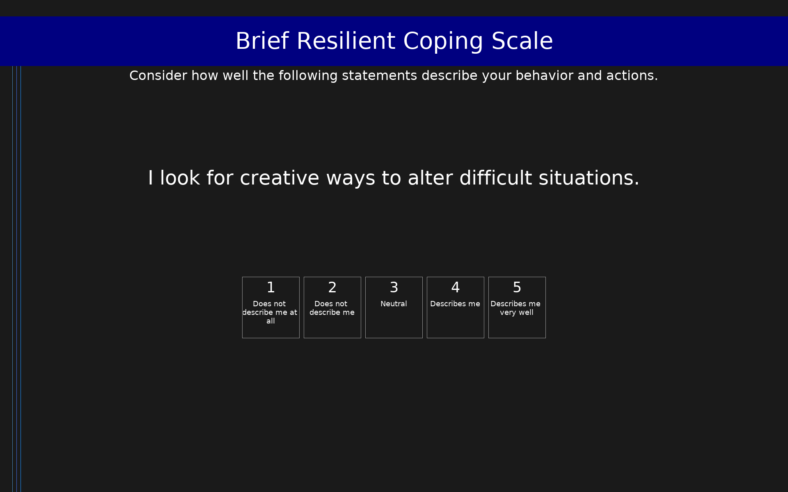

# Brief Resilient Coping Scale (BRCS)

4-item measure of resilient coping tendencies. Scores range from 4 to 20. Low resilience: 4-13, medium: 14-16, high: 17-20.

## Overview

- **Code:** `BRCS`
- **Items:** 0
- **Languages:** en
- **Version:** 1.0
- **License:** Public Domain

## Dimensions

| ID | Name | Description |
|----|------|-------------|
| `resilient_coping` | Resilient Coping |  |

## Questions

## Scoring

- **resilient_coping**: sum_coded (4 items)
  - Sum of all items (4-20). Low: 4-13, Medium: 14-16, High: 17-20.

## Citation

Sinclair, V. G., & Wallston, K. A. (2004). The development and psychometric evaluation of the Brief Resilient Coping Scale. Assessment, 11(1), 94-101. https://doi.org/10.1177/1073191103258144

**URL:** https://doi.org/10.1177/1073191103258144

## Files

- `BRCS.en.json`
- `BRCS.json`
- `README.md`
- `screenshot.png`

---
*This README was auto-generated by `tools/generate_readmes.py`.*
