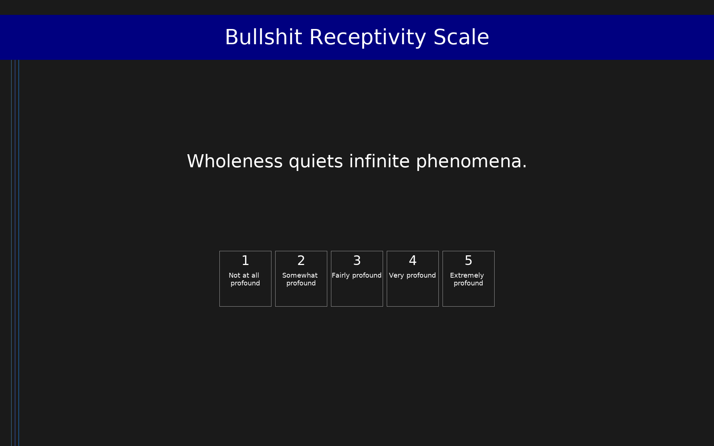

# Bullshit Receptivity Scale (BSR)

The Bullshit Receptivity Scale (BSR) assesses the tendency to perceive pseudo-profound but meaningless statements as profound. Participants rate 30 statements on a 1–5 profundity scale. The 30 statements include 10 pseudo-profound bullshit items (randomly generated from buzzword generators), 10 motivational quotations (conventionally profound), and 10 mundane statements (clearly not profound). The primary measure is the mean rating of the 10 pseudo-profound items; higher scores indicate greater receptivity to bullshit. Secondary measures assess sensitivity (bullshit minus motivational rating difference) and response bias.

## Overview

- **Code:** `BSR`
- **Items:** 0
- **Languages:** en
- **Version:** 1.0
- **License:** CC BY 4.0

## Dimensions

| ID | Name | Description |
|----|------|-------------|
| `bullshit_receptivity` | Bullshit Receptivity |  |
| `motivational_ratings` | Motivational Statement Ratings |  |
| `mundane_ratings` | Mundane Statement Ratings |  |

## Questions

## Scoring

- **bullshit_receptivity**: mean_coded (10 items)
  - Mean profundity rating of the 10 pseudo-profound bullshit statements. Range 1–5. Higher scores indicate greater receptivity to bullshit.
- **motivational_ratings**: mean_coded (10 items)
  - Mean profundity rating of the 10 motivational quotations. Range 1–5.
- **mundane_ratings**: mean_coded (10 items)
  - Mean profundity rating of the 10 mundane statements. Range 1–5.

## Citation

Pennycook, G., Cheyne, J. A., Barr, N., Koehler, D. J., & Fugelsang, J. A. (2015). On the reception and detection of pseudo-profound bullshit. Judgment and Decision Making, 10(6), 549–563.

**URL:** https://doi.org/10.1017/S1930297500006999

## Files

- `BSR.en.json`
- `BSR.json`
- `screenshot.png`

---
*This README was auto-generated by `tools/generate_readmes.py`.*
