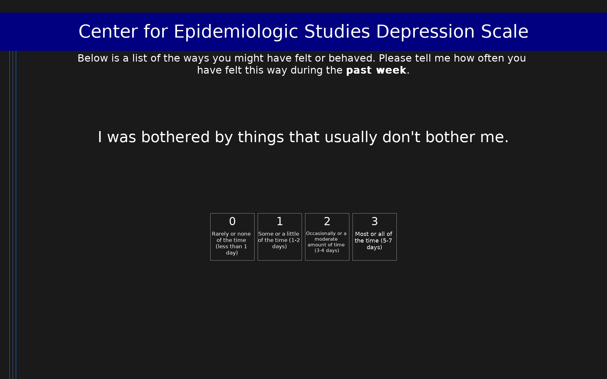

# Center for Epidemiologic Studies Depression Scale (CES-D)

20-item self-report depression scale measuring depressive symptoms over the past week. Scores range from 0 to 60, with a threshold of 16 indicating clinically significant depression.

## Overview

- **Code:** `CESD`
- **Items:** 0
- **Languages:** en
- **Version:** 1.0
- **License:** Public Domain

## Dimensions

| ID | Name | Description |
|----|------|-------------|
| `depression` | Depression |  |

## Questions

## Scoring

- **depression**: sum_coded (20 items)
  - Sum of all items after reverse coding positive affect items cesd4, cesd8, cesd12, cesd16 (0-60). Scores of 16 or higher indicate clinically significant depressive symptoms.

## Citation

Radloff, L. S. (1977). The CES-D scale: A self-report depression scale for research in the general population. Applied Psychological Measurement, 1(3), 385-401.

**URL:** https://doi.org/10.1177/014662167700100306

## Files

- `CESD.en.json`
- `CESD.json`
- `README.md`
- `screenshot.png`

---
*This README was auto-generated by `tools/generate_readmes.py`.*
