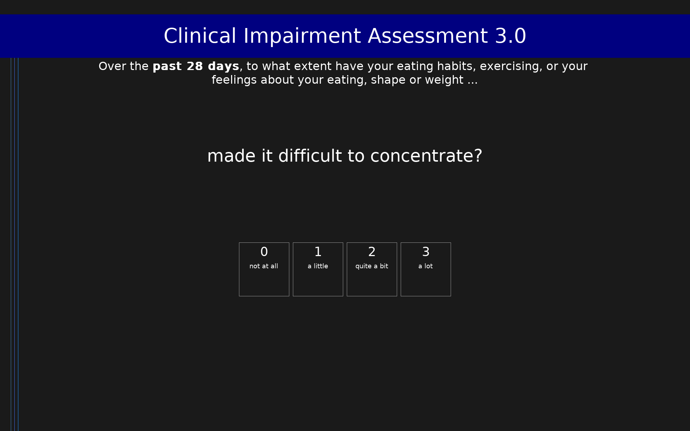

# Clinical Impairment Assessment 3.0 (CIA 3.0)

16-item measure of psychosocial impairment due to eating disorder features over the past 28 days. Scores range from 0 to 48. A score of 16 or above may indicate clinical significance.

## Overview

- **Code:** `CIA`
- **Items:** 0
- **Languages:** en
- **Version:** 1.0
- **License:** CC BY 3.0

## Dimensions

| ID | Name | Description |
|----|------|-------------|
| `impairment` | Clinical Impairment |  |

## Questions

## Scoring

- **impairment**: sum_coded (16 items)
  - Sum of all items (0-48). Score of 16+ suggests clinically significant impairment due to eating disorder features.

## Citation

Bohn, K., Doll, H. A., Cooper, Z., O'Connor, M., Palmer, R. L., & Fairburn, C. G. (2008). The measurement of impairment due to eating disorder psychopathology. Behaviour Research and Therapy, 46(10), 1105-1110. https://doi.org/10.1016/j.brat.2008.06.012

**URL:** https://doi.org/10.1016/j.brat.2008.06.012

## Files

- `CIA.en.json`
- `CIA.json`
- `README.md`
- `screenshot.png`

---
*This README was auto-generated by `tools/generate_readmes.py`.*
