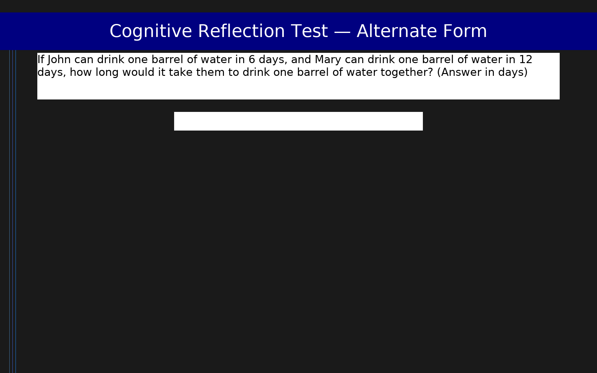

# Cognitive Reflection Test — Alternate Form (CRT-2)

4-item alternate form of the Cognitive Reflection Test measuring the tendency to override incorrect intuitive responses and engage in further reflection

## Overview

- **Code:** `CRT2`
- **Items:** 0
- **Languages:** en
- **Version:** 1.0
- **License:** CC BY 4.0

## Dimensions

| ID | Name | Description |
|----|------|-------------|
| `reflection` | Cognitive Reflection | Number of correct responses reflecting analytic rather than intuitive thinking (0-4) |

## Questions

## Scoring

- **reflection**: sum_correct (4 items)
  - Number of correct responses (0-4)

## Citation

Thomson, K. S., & Oppenheimer, D. M. (2016). Investigating an alternate form of the cognitive reflection test. Judgment and Decision Making, 11(1), 99-113.

**URL:** https://journal.sjdm.org/15/15909/jdm15909.pdf

## Files

- `CRT2.en.json`
- `CRT2.json`
- `screenshot.png`

---
*This README was auto-generated by `tools/generate_readmes.py`.*
