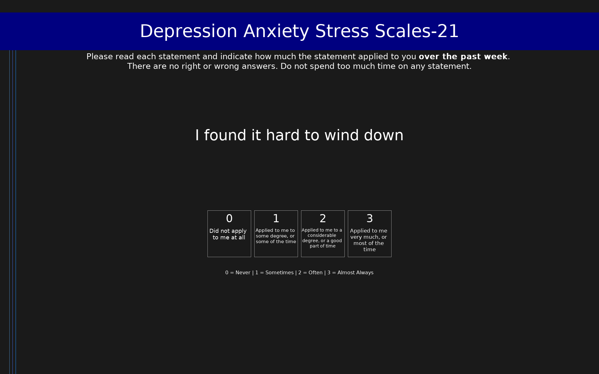

# Depression Anxiety Stress Scales-21 (DASS-21)

21-item short form measuring depression, anxiety, and stress over the past week. Each subscale has 7 items scored 0-3. Multiply subscale sums by 2 to compare with DASS-42 norms (0-42 range per subscale).

## Overview

- **Code:** `DASS21`
- **Items:** 0
- **Languages:** ar, bg, bs, da, de, el, en, es, eu, fa, fi, fil, fr, hi, hr, hu, id, it, ja, ko, lt, lv, mn, ne, no, pt, ro, ru, sk, sl, sq, sr, sv, ta, th, tr, uk, vi, zh
- **Version:** 1.0
- **License:** Public Domain

## Dimensions

| ID | Name | Description |
|----|------|-------------|
| `depression` | Depression |  |
| `anxiety` | Anxiety |  |
| `stress` | Stress |  |

## Questions

## Scoring

- **depression**: sum_coded (7 items)
  - Sum of 7 depression items (0-21); multiply by 2 to compare with DASS-42 norms. Severity (x2): 0-9 normal, 10-13 mild, 14-20 moderate, 21-27 severe, 28+ extremely severe.
- **anxiety**: sum_coded (7 items)
  - Sum of 7 anxiety items (0-21); multiply by 2 to compare with DASS-42 norms. Severity (x2): 0-7 normal, 8-9 mild, 10-14 moderate, 15-19 severe, 20+ extremely severe.
- **stress**: sum_coded (7 items)
  - Sum of 7 stress items (0-21); multiply by 2 to compare with DASS-42 norms. Severity (x2): 0-14 normal, 15-18 mild, 19-25 moderate, 26-33 severe, 34+ extremely severe.

## Citation

Lovibond, S. H., & Lovibond, P. F. (1995). Manual for the Depression Anxiety Stress Scales (2nd ed.). Psychology Foundation of Australia.

**URL:** http://www2.psy.unsw.edu.au/dass/

## Files

- `DASS21.ar.json`
- `DASS21.bg.json`
- `DASS21.bs.json`
- `DASS21.da.json`
- `DASS21.de.json`
- `DASS21.el.json`
- `DASS21.en.json`
- `DASS21.es.json`
- `DASS21.eu.json`
- `DASS21.fa.json`
- `DASS21.fi.json`
- `DASS21.fil.json`
- `DASS21.fr.json`
- `DASS21.hi.json`
- `DASS21.hr.json`
- `DASS21.hu.json`
- `DASS21.id.json`
- `DASS21.it.json`
- `DASS21.ja.json`
- `DASS21.json`
- `DASS21.ko.json`
- `DASS21.lt.json`
- `DASS21.lv.json`
- `DASS21.mn.json`
- `DASS21.ne.json`
- `DASS21.no.json`
- `DASS21.osd`
- `DASS21.pt.json`
- `DASS21.ro.json`
- `DASS21.ru.json`
- `DASS21.sk.json`
- `DASS21.sl.json`
- `DASS21.sq.json`
- `DASS21.sr.json`
- `DASS21.sv.json`
- `DASS21.ta.json`
- `DASS21.th.json`
- `DASS21.tr.json`
- `DASS21.uk.json`
- `DASS21.vi.json`
- `DASS21.zh.json`
- `README.md`
- `screenshot.png`

---
*This README was auto-generated by `tools/generate_readmes.py`.*
