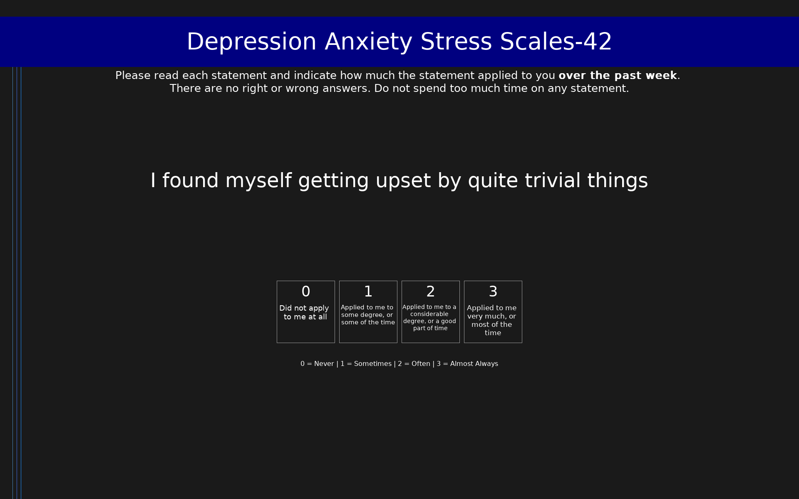

# Depression Anxiety Stress Scales-42 (DASS-42)

42-item full-length measure of depression, anxiety, and stress over the past week. Each subscale has 14 items scored 0-3 (range 0-42 per subscale).

## Overview

- **Code:** `DASS42`
- **Items:** 0
- **Languages:** ar, bg, bs, cs, da, de, el, en, es, eu, fa, fi, fr, he, hi, hu, id, ja, ko, lv, ms, nl, no, sk, sl, sq, sr, sv, th, tr, vi, zh
- **Version:** 1.0
- **License:** Public Domain

## Dimensions

| ID | Name | Description |
|----|------|-------------|
| `depression` | Depression |  |
| `anxiety` | Anxiety |  |
| `stress` | Stress |  |

## Questions

## Scoring

- **depression**: sum_coded (14 items)
  - Sum of 14 depression items (0-42). Severity: 0-9 normal, 10-13 mild, 14-20 moderate, 21-27 severe, 28+ extremely severe.
- **anxiety**: sum_coded (14 items)
  - Sum of 14 anxiety items (0-42). Severity: 0-7 normal, 8-9 mild, 10-14 moderate, 15-19 severe, 20+ extremely severe.
- **stress**: sum_coded (14 items)
  - Sum of 14 stress items (0-42). Severity: 0-14 normal, 15-18 mild, 19-25 moderate, 26-33 severe, 34+ extremely severe.

## Citation

Lovibond, S. H., & Lovibond, P. F. (1995). Manual for the Depression Anxiety Stress Scales (2nd ed.). Psychology Foundation of Australia.

**URL:** http://www2.psy.unsw.edu.au/dass/

## Files

- `DASS42.ar.json`
- `DASS42.bg.json`
- `DASS42.bs.json`
- `DASS42.cs.json`
- `DASS42.da.json`
- `DASS42.de.json`
- `DASS42.el.json`
- `DASS42.en.json`
- `DASS42.es.json`
- `DASS42.eu.json`
- `DASS42.fa.json`
- `DASS42.fi.json`
- `DASS42.fr.json`
- `DASS42.he.json`
- `DASS42.hi.json`
- `DASS42.hu.json`
- `DASS42.id.json`
- `DASS42.ja.json`
- `DASS42.json`
- `DASS42.ko.json`
- `DASS42.lv.json`
- `DASS42.ms.json`
- `DASS42.nl.json`
- `DASS42.no.json`
- `DASS42.osd`
- `DASS42.sk.json`
- `DASS42.sl.json`
- `DASS42.sq.json`
- `DASS42.sr.json`
- `DASS42.sv.json`
- `DASS42.th.json`
- `DASS42.tr.json`
- `DASS42.vi.json`
- `DASS42.zh.json`
- `README.md`
- `screenshot.png`

---
*This README was auto-generated by `tools/generate_readmes.py`.*
