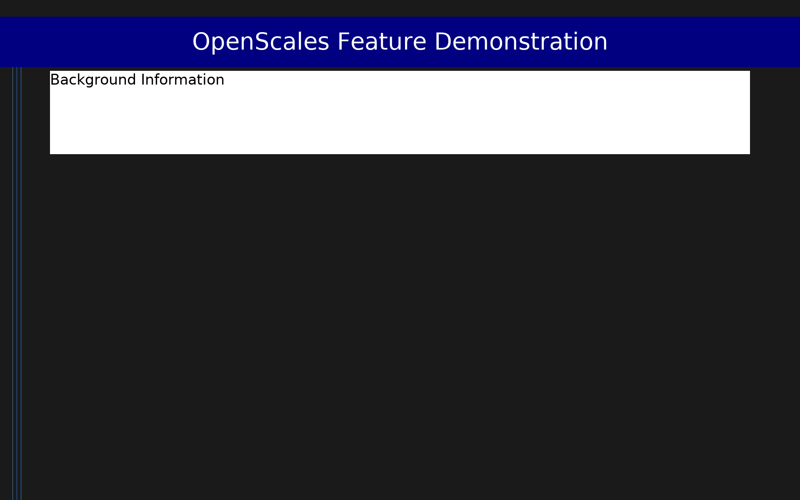

# OpenScales Feature Demonstration (DEMO)

Comprehensive demonstration scale exercising all major OpenScales/ScaleRunner features: (1) all question types — likert, multi, multicheck, short, long, vas, grid, inst; (2) multiple sections; (3) section-order randomization with fixed sections (randomize_sections); (4) section-level item shuffle with pinned items (randomize.method='shuffle', fixed); (5) item-level random_group shuffle; (6) dependent sections — visible_when on section markers; (7) dependent items — visible_when on item answers, including 'in' operator; (8) required vs. optional items; (9) input validation on short answers; (10) per-item Likert scale override; (11) forward and reverse scoring across two dimensions. Use this scale to verify all engine features work correctly after changes.

## Overview

- **Code:** `DEMO`
- **Items:** 0
- **Languages:** en
- **Version:** 1.0
- **License:** Public domain

## Dimensions

| ID | Name | Description |
|----|------|-------------|
| `attitudes` | Attitudes Toward Technology |  |
| `wellbeing` | Subjective Well-being |  |

## Questions

## Scoring

- **attitudes**: mean_coded (5 items)
  - Mean of 5 items after reverse-scoring att3 and att5 (coding=-1). Range 1-5. Higher = more positive attitude toward technology.
- **wellbeing**: mean_coded (3 items)
  - Mean of 3 VAS items. Range 0-100. Higher = greater subjective well-being.

## Citation

OpenScales internal demonstration scale — not for research use.

## Files

- `DEMO.en.json`
- `DEMO.json`
- `screenshot.png`

---
*This README was auto-generated by `tools/generate_readmes.py`.*
