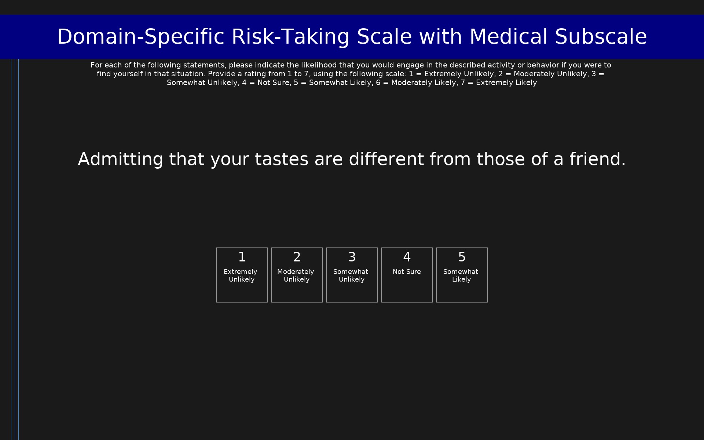

# Domain-Specific Risk-Taking Scale with Medical Subscale (DOSPERT+M)

36-item scale extending the DOSPERT (Blais & Weber, 2006) with a 6-item medical risk domain subscale (Butler et al., 2012). Items 1-30 are the standard DOSPERT items assessing risk-taking likelihood across five domains (ethical, financial, health/safety, recreational, social); items 31-36 are the medical domain items. All items use a 7-point scale from 1 (Extremely Unlikely) to 7 (Extremely Likely). Subscale scores are computed as the mean of the 6 items in each domain.

## Overview

- **Code:** `DOSPERT-M`
- **Items:** 0
- **Languages:** en
- **Version:** 1.0
- **License:** CC BY 4.0

## Dimensions

| ID | Name | Description |
|----|------|-------------|
| `ethical` | Ethical |  |
| `financial` | Financial |  |
| `health_safety` | Health/Safety |  |
| `recreational` | Recreational |  |
| `social` | Social |  |
| `medical` | Medical |  |

## Questions

## Scoring

- **ethical**: mean_coded (6 items)
  - Mean of 6 ethical risk-taking items (range 1-7). Higher scores indicate greater ethical risk taking.
- **financial**: mean_coded (6 items)
  - Mean of 6 financial risk-taking items (range 1-7). Higher scores indicate greater financial risk taking.
- **health_safety**: mean_coded (6 items)
  - Mean of 6 health/safety risk-taking items (range 1-7). Higher scores indicate greater health/safety risk taking.
- **recreational**: mean_coded (6 items)
  - Mean of 6 recreational risk-taking items (range 1-7). Higher scores indicate greater recreational risk taking.
- **social**: mean_coded (6 items)
  - Mean of 6 social risk-taking items (range 1-7). Higher scores indicate greater social risk taking.
- **medical**: mean_coded (6 items)
  - Mean of 6 medical risk-taking items (range 1-7). Higher scores indicate greater willingness to engage in risky medical activities. Cronbach's alpha = 0.57 (Butler et al., 2012).

## Citation

Butler, S., Rosman, A., Seleski, S., Garcia, M., Lee, S., Barnes, J., & Schwartz, A. (2012). A medical risk attitude subscale for DOSPERT. Judgment and Decision Making, 7(2), 189-195. [Medical subscale]; Blais, A.-R., & Weber, E. U. (2006). A Domain-Specific Risk-Taking (DOSPERT) scale for adult populations. Judgment and Decision Making, 1(1), 33-47. [Base scale]

**URL:** https://www.sas.upenn.edu/~baron/journal/11/112228/jdm111228.pdf

## Files

- `DOSPERT-M.en.json`
- `DOSPERT-M.json`
- `screenshot.png`

---
*This README was auto-generated by `tools/generate_readmes.py`.*
