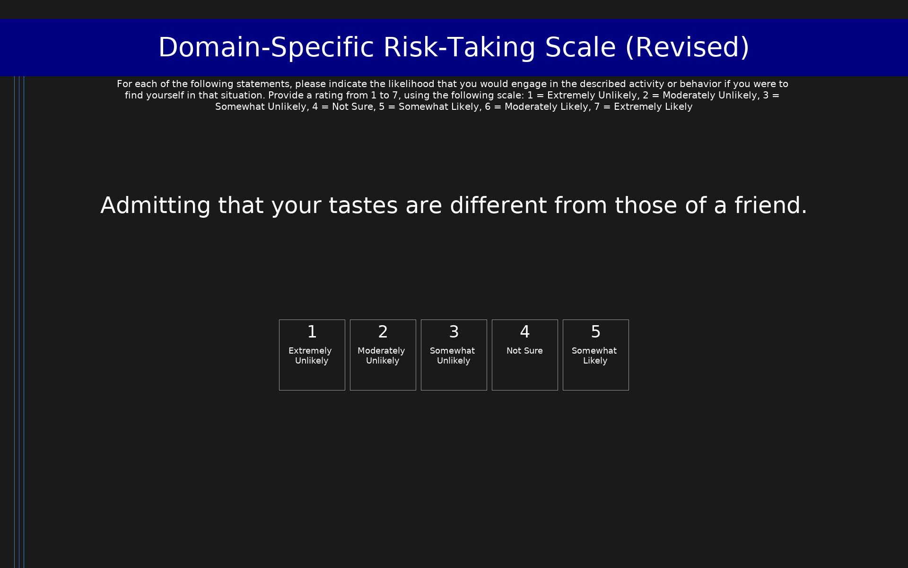

# Domain-Specific Risk-Taking Scale (Revised) (DOSPERT)

30-item scale assessing the likelihood of engaging in risky behaviors across five domains: ethical, financial, health/safety, recreational, and social. Each domain contains 6 items rated on a 7-point scale from 1 (Extremely Unlikely) to 7 (Extremely Likely). Subscale scores are computed as the mean of the 6 items in each domain.

## Overview

- **Code:** `DOSPERT`
- **Items:** 0
- **Languages:** en
- **Version:** 1.0
- **License:** CC BY 4.0

## Dimensions

| ID | Name | Description |
|----|------|-------------|
| `ethical` | Ethical |  |
| `financial` | Financial |  |
| `health_safety` | Health/Safety |  |
| `recreational` | Recreational |  |
| `social` | Social |  |

## Questions

## Scoring

- **ethical**: mean_coded (6 items)
  - Mean of 6 ethical risk-taking items (range 1-7). Higher scores indicate greater ethical risk taking.
- **financial**: mean_coded (6 items)
  - Mean of 6 financial risk-taking items (range 1-7). Higher scores indicate greater financial risk taking.
- **health_safety**: mean_coded (6 items)
  - Mean of 6 health/safety risk-taking items (range 1-7). Higher scores indicate greater health/safety risk taking.
- **recreational**: mean_coded (6 items)
  - Mean of 6 recreational risk-taking items (range 1-7). Higher scores indicate greater recreational risk taking.
- **social**: mean_coded (6 items)
  - Mean of 6 social risk-taking items (range 1-7). Higher scores indicate greater social risk taking.

## Citation

Blais, A.-R., & Weber, E. U. (2006). A Domain-Specific Risk-Taking (DOSPERT) scale for adult populations. Judgment and Decision Making, 1(1), 33-47.

**URL:** https://doi.org/10.1017/S1930297500000334

## Files

- `DOSPERT.en.json`
- `DOSPERT.json`
- `screenshot.png`

---
*This README was auto-generated by `tools/generate_readmes.py`.*
