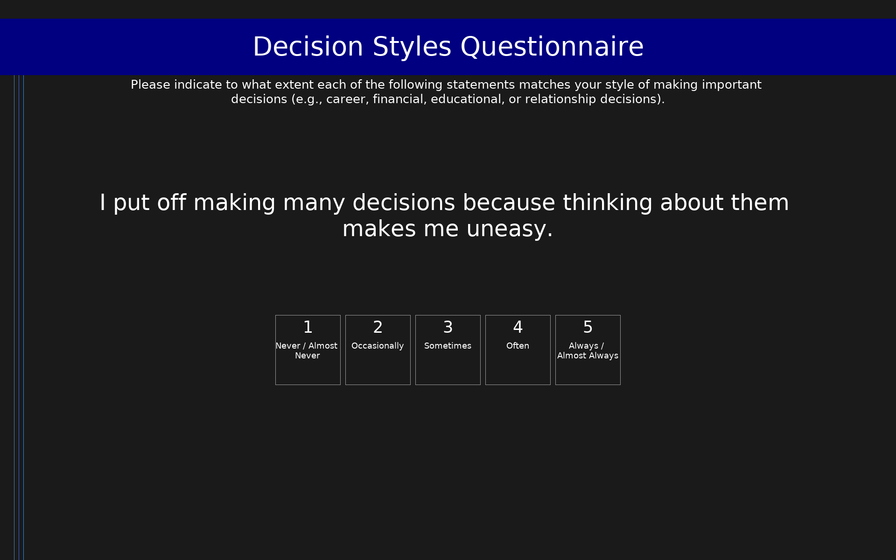

# Decision Styles Questionnaire (DSQ)

61-item self-report questionnaire measuring individual differences in decision-making styles and decisional self-esteem. Developed through factor analysis retaining 9 factors: Avoidant, Brooding, Anxious, Vigilant, Intuitive, Spontaneous, Dependent, Reflective, and Decisional Self-Esteem. Items rated on a 5-point scale (1 = Never/Almost Never, 5 = Always/Almost Always). Higher scores on each subscale indicate a stronger tendency toward that style. Avoidant, Brooding, and Anxious styles are positively associated with depressive symptoms; Vigilant and Intuitive styles are negatively associated.

## Overview

- **Code:** `DSQ`
- **Items:** 0
- **Languages:** en
- **Version:** 1.0
- **License:** CC BY 4.0

## Dimensions

| ID | Name | Description |
|----|------|-------------|
| `avoidant` | Avoidant | Tendency to avoid or procrastinate in decision making |
| `brooding` | Brooding | Tendency to ruminate and dwell on past decisions and outcomes |
| `anxious` | Anxious | Tendency to experience anxiety and distress during decision making |
| `vigilant` | Vigilant | Tendency to carefully consider all alternatives and information before deciding |
| `intuitive` | Intuitive | Tendency to rely on gut feelings and intuition when making decisions |
| `spontaneous` | Spontaneous | Tendency to make quick, immediate decisions without extended deliberation |
| `dependent` | Dependent | Tendency to rely on advice and support from others when making decisions |
| `reflective` | Reflective | Tendency to carefully deliberate and reflect before and after decisions |
| `self_esteem` | Decisional Self-Esteem | Perceived competence and confidence as a decision maker |

## Questions

## Scoring

- **avoidant**: mean_coded (7 items)
  - Mean of Avoidant items (1-5). Higher scores indicate greater tendency to avoid or delay decision making. Positively associated with depressive symptoms.
- **brooding**: mean_coded (7 items)
  - Mean of Brooding items (1-5). Higher scores indicate greater rumination about past decisions. Positively associated with depressive symptoms.
- **anxious**: mean_coded (7 items)
  - Mean of Anxious items (1-5). Higher scores indicate greater anxiety and worry during decision making. Positively associated with depressive symptoms.
- **vigilant**: mean_coded (7 items)
  - Mean of Vigilant items (1-5). Higher scores indicate careful, thorough consideration of alternatives. Negatively associated with depressive symptoms.
- **intuitive**: mean_coded (7 items)
  - Mean of Intuitive items (1-5). Higher scores indicate greater reliance on gut feelings and intuition. Negatively associated with depressive symptoms.
- **spontaneous**: mean_coded (7 items)
  - Mean of Spontaneous items (1-5). Higher scores indicate greater tendency for quick, spur-of-the-moment decisions. Not significantly associated with depressive symptoms.
- **dependent**: mean_coded (7 items)
  - Mean of Dependent items (1-5). Higher scores indicate greater reliance on others' advice. Not significantly associated with depressive symptoms.
- **reflective**: mean_coded (7 items)
  - Mean of Reflective items (1-5). Higher scores indicate greater tendency to deliberate carefully before and after decisions.
- **self_esteem**: mean_coded (5 items)
  - Mean of Decisional Self-Esteem items (1-5) after reverse-coding negative items (dsq60, dsq61). Higher scores indicate greater confidence and competence as a decision maker.

## Citation

Leykin, Y., & DeRubeis, R. J. (2010). Decision-making styles and depressive symptomatology: Development of the Decision Styles Questionnaire. Judgment and Decision Making, 5(7), 506-515. https://doi.org/10.1017/S1930297500001674

**URL:** https://doi.org/10.1017/S1930297500001674

## Files

- `DSQ.en.json`
- `DSQ.json`
- `screenshot.png`

---
*This README was auto-generated by `tools/generate_readmes.py`.*
