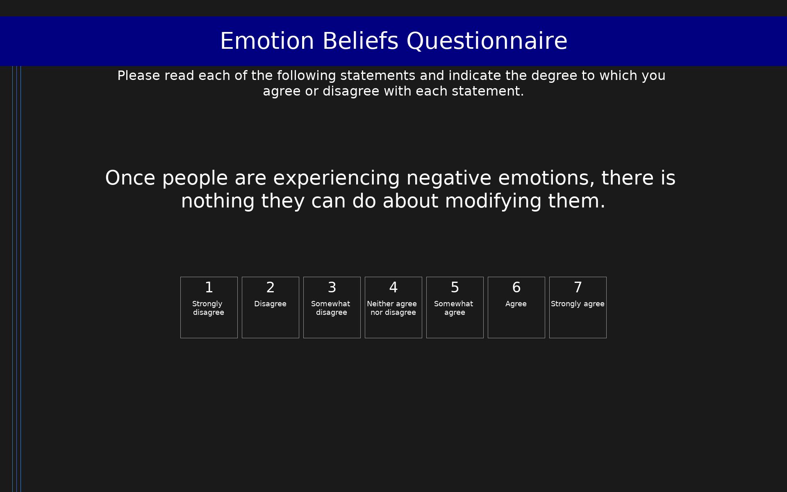

# Emotion Beliefs Questionnaire (EBQ)

16-item self-report measure of beliefs about the controllability and usefulness of negative and positive emotions.

## Overview

- **Code:** `EBQ`
- **Items:** 0
- **Languages:** en
- **Version:** 1.0
- **License:** CC BY 4.0

## Dimensions

| ID | Name | Description |
|----|------|-------------|
| `controllability` | Controllability | Beliefs about the controllability of emotions (negative and positive). Higher scores indicate stronger beliefs that emotions are uncontrollable. |
| `usefulness` | Usefulness | Beliefs about the usefulness of emotions (negative and positive). Higher scores indicate stronger beliefs that emotions are useless. |

## Questions

## Scoring

- **controllability**: mean (8 items)
  - Mean of all 8 controllability items (4 negative-controllability + 4 positive-controllability). Higher scores indicate stronger beliefs that emotions are uncontrollable.
- **usefulness**: mean (8 items)
  - Mean of all 8 usefulness items (4 negative-usefulness + 4 positive-usefulness). Higher scores indicate stronger beliefs that emotions are useless.

## Citation

Becerra, R., Preece, D. A., & Gross, J. J. (2020). Assessing beliefs about emotions: Development and validation of the Emotion Beliefs Questionnaire. PLOS ONE, 15(4), e0231395. https://doi.org/10.1371/journal.pone.0231395

**URL:** https://doi.org/10.1371/journal.pone.0231395

## Files

- `EBQ.en.json`
- `EBQ.json`
- `screenshot.png`

---
*This README was auto-generated by `tools/generate_readmes.py`.*
