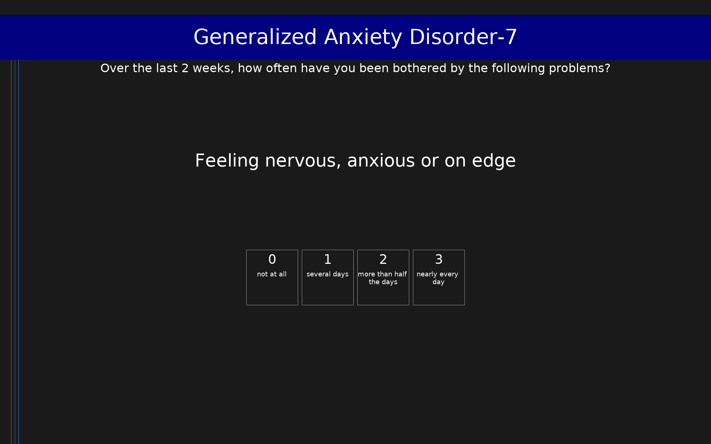

# Generalized Anxiety Disorder-7 (GAD-7)

7-item anxiety screening tool measuring symptom severity over the past 2 weeks. Scores range from 0 to 21.

## Overview

- **Code:** `GAD7`
- **Items:** 0
- **Languages:** en
- **Version:** 1.0
- **License:** Public Domain

## Dimensions

| ID | Name | Description |
|----|------|-------------|
| `anxiety` | Anxiety Severity |  |

## Questions

## Scoring

- **anxiety**: sum_coded (7 items)
  - Sum of all items (0-21). Severity: 0-4 minimal, 5-9 mild, 10-14 moderate, 15-21 severe.

## Citation

Spitzer, R. L., Kroenke, K., Williams, J. B., & Lowe, B. (2006). A brief measure for assessing generalized anxiety disorder: The GAD-7. Archives of Internal Medicine, 166(10), 1092-1097. https://doi.org/10.1001/archinte.166.10.1092

**URL:** https://doi.org/10.1001/archinte.166.10.1092

## Files

- `GAD7.en.json`
- `GAD7.json`
- `README.md`
- `screenshot.png`

---
*This README was auto-generated by `tools/generate_readmes.py`.*
