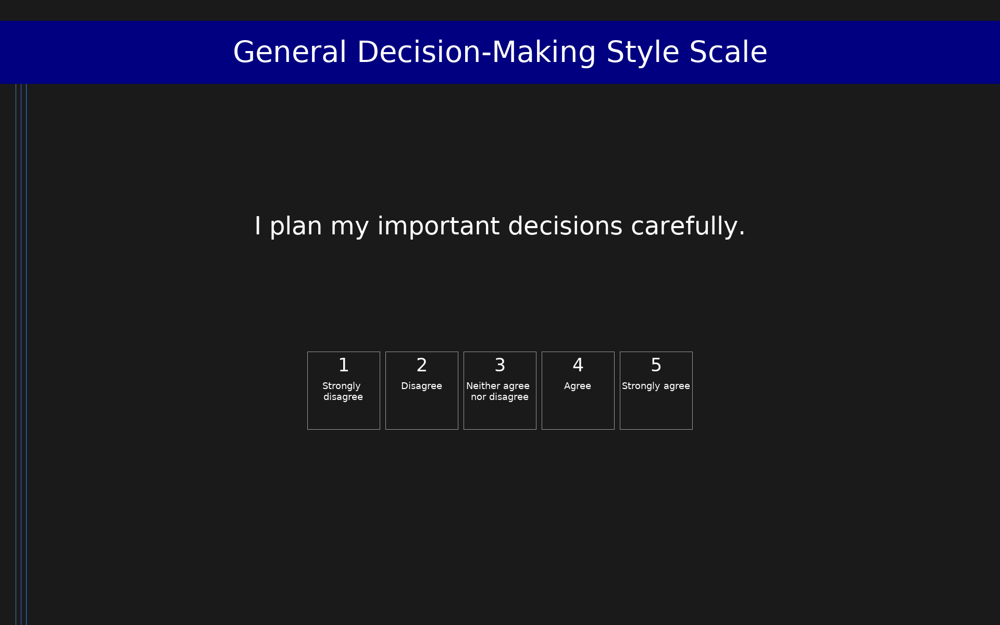

# General Decision-Making Style Scale (GDMS)

The General Decision-Making Style (GDMS) scale assesses five habitual decision-making styles: rational (systematic, logical approach), intuitive (reliance on feelings and hunches), dependent (seeking advice from others), avoidant (postponing or avoiding decisions), and spontaneous (quick, impulsive decisions). Participants rate 25 items on a 5-point agreement scale. Each subscale comprises 5 items; higher scores indicate greater use of that style. The GDMS is validated in Judgment and Decision Making in its Spanish adaptation (Salgado-Orellana et al., 2019).

## Overview

- **Code:** `GDMS`
- **Items:** 0
- **Languages:** en
- **Version:** 1.0
- **License:** CC BY 4.0

## Dimensions

| ID | Name | Description |
|----|------|-------------|
| `rational` | Rational |  |
| `intuitive` | Intuitive |  |
| `dependent` | Dependent |  |
| `avoidant` | Avoidant |  |
| `spontaneous` | Spontaneous |  |

## Questions

## Scoring

- **rational**: mean_coded (5 items)
  - Mean of 5 rational items. Range 1–5. Higher scores indicate a more rational, systematic decision-making style.
- **intuitive**: mean_coded (5 items)
  - Mean of 5 intuitive items. Range 1–5. Higher scores indicate greater reliance on feelings and hunches.
- **dependent**: mean_coded (5 items)
  - Mean of 5 dependent items. Range 1–5. Higher scores indicate greater reliance on others' advice.
- **avoidant**: mean_coded (5 items)
  - Mean of 5 avoidant items. Range 1–5. Higher scores indicate greater tendency to avoid or postpone decisions.
- **spontaneous**: mean_coded (5 items)
  - Mean of 5 spontaneous items. Range 1–5. Higher scores indicate more impulsive, quick decision-making.

## Citation

Scott, S. G., & Bruce, R. A. (1995). Decision-making style: The development and assessment of a new measure. Educational and Psychological Measurement, 55(5), 818–831. Spanish validation: Salgado-Orellana, N., Berrios-Martos, P., Guarino, L., & García-Martínez, J. M. A. (2019). Spanish validation of General Decision-Making Style scale: Sex invariance, sex differences and relationships with personality and coping styles. Judgment and Decision Making, 14(6), 670–683.

**URL:** https://www.sas.upenn.edu/~baron/journal/19/190621a/jdm190621a.html

## Files

- `GDMS.en.json`
- `GDMS.json`
- `screenshot.png`

---
*This README was auto-generated by `tools/generate_readmes.py`.*
