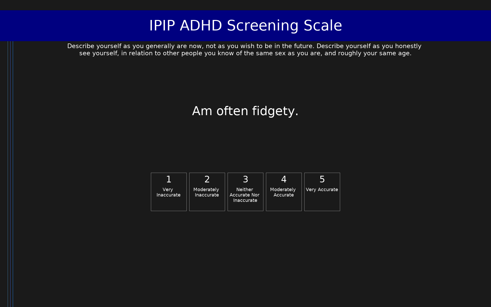

# IPIP ADHD Screening Scale (IPIP-ADHD)

IPIP items measuring ADHD-related symptoms.

## Overview

- **Code:** `IPIP-ADHD`
- **Items:** 0
- **Languages:** en
- **Version:** 1.0
- **License:** Public Domain

## Dimensions

| ID | Name | Description |
|----|------|-------------|
| `adhd` | ADHD |  |

## Questions

## Scoring

- **adhd**: sum_coded (12 items)
  - Cronbach's alpha = 0.78

## Citation

Span, S. A., Earleywine, M., & Strybel, T. Z. (2002). Confirming the factor structure of attention deficit hyperactivity disorder symptoms in adult, nonclinical samples. Journal of Clinical Psychology, 58(5), 497-507.

**URL:** https://ipip.ori.org/newSingleConstructsKey.htm#ADHD

## Files

- `IPIP-ADHD.en.json`
- `IPIP-ADHD.json`
- `screenshot.png`

---
*This README was auto-generated by `tools/generate_readmes.py`.*
