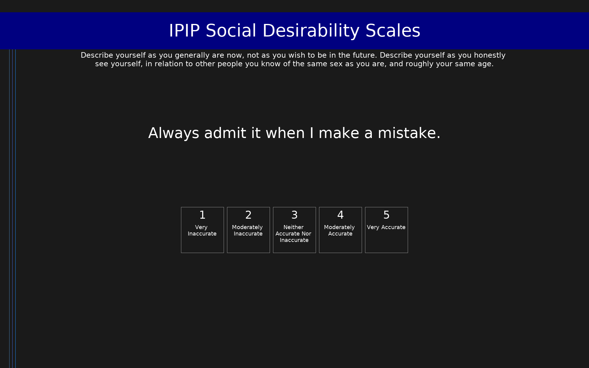

# IPIP Social Desirability Scales (IPIP-BIDR)

IPIP representation of the BIDR measuring impression management, self-deception, and cognitive failures.

## Overview

- **Code:** `IPIP-BIDR`
- **Items:** 0
- **Languages:** en
- **Version:** 1.0
- **License:** Public Domain

## Dimensions

| ID | Name | Description |
|----|------|-------------|
| `impressionmanagement` | Impression-Management |  |
| `selfdeception` | Self-deception |  |
| `cognitivefailures` | Cognitive-Failures |  |

## Questions

## Scoring

- **impressionmanagement**: mean_coded (20 items)
  - Cronbach's alpha = 0.87
- **selfdeception**: mean_coded (10 items)
  - Cronbach's alpha = 0.80
- **cognitivefailures**: mean_coded (10 items)
  - Cronbach's alpha = 0.79

## Citation

Paulhus, D. L. (1991). Measurement and control of response bias. In J. P. Robinson, P. R. Shaver, & L. S. Wrightsman (Eds.), Measures of Personality and Social Psychological Attitudes (pp. 17-59). Academic Press.

**URL:** https://ipip.ori.org/newSingleConstructsKey.htm

## Files

- `IPIP-BIDR.en.json`
- `IPIP-BIDR.json`
- `screenshot.png`

---
*This README was auto-generated by `tools/generate_readmes.py`.*
