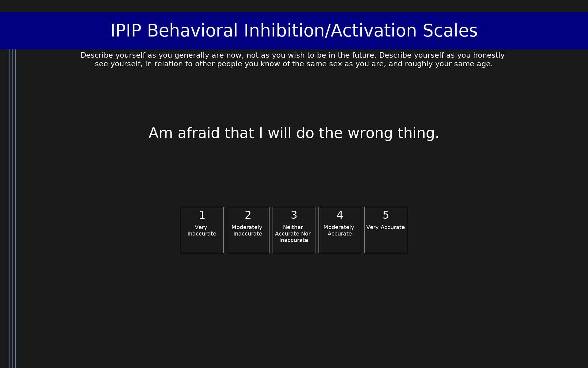

# IPIP Behavioral Inhibition/Activation Scales (IPIP-BIS/BAS)

IPIP representation of Carver & White's BIS/BAS scales measuring behavioral inhibition and activation systems.

## Overview

- **Code:** `IPIP-BISBAS`
- **Items:** 0
- **Languages:** en
- **Version:** 1.0
- **License:** Public Domain

## Dimensions

| ID | Name | Description |
|----|------|-------------|
| `behavioral_inhibition_activation_system` | Behavioral Inhibition/Activation System |  |
| `anxiety` | Anxiety |  |
| `excitementseeking` | Excitement-seeking |  |
| `ambition_drive` | Ambition/Drive |  |
| `risktaking_sensationseeking_thrillseeking` | Risk-taking/Sensation-Seeking/Thrill-Seeking |  |

## Questions

## Scoring

- **behavioral_inhibition_activation_system**: mean_coded (10 items)
  - Cronbach's alpha = 1994.00
- **anxiety**: mean_coded (6 items)
  - Cronbach's alpha = 1994.00
- **excitementseeking**: mean_coded (6 items)
  - Cronbach's alpha = 0.68
- **ambition_drive**: mean_coded (10 items)
  - Cronbach's alpha = 0.77
- **risktaking_sensationseeking_thrillseeking**: mean_coded (10 items)
  - Cronbach's alpha = 0.79

## Citation

Carver, C. S., & White, T. L. (1994). Behavioral inhibition, behavioral activation, and affective responses to impending reward and punishment. Journal of Personality and Social Psychology, 67(2), 319-333.

**URL:** https://ipip.ori.org/newBISBASKey.htm

## Files

- `IPIP-BISBAS.en.json`
- `IPIP-BISBAS.json`
- `screenshot.png`

---
*This README was auto-generated by `tools/generate_readmes.py`.*
