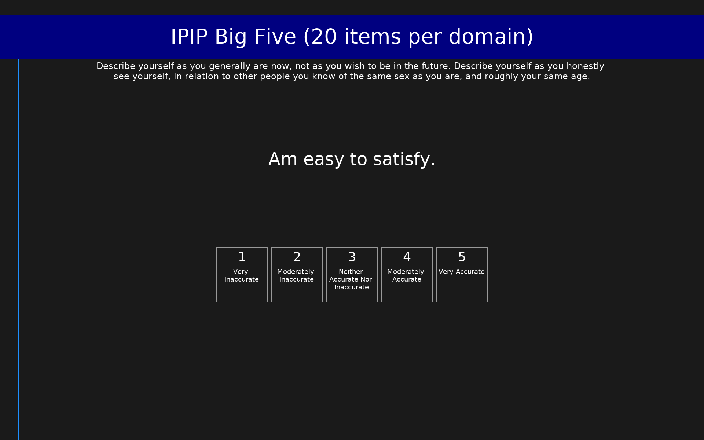

# IPIP Big Five (20 items per domain) (IPIP-100)

100-item IPIP measure of the Big Five personality domains (20 items per domain). Domain-level scoring only.

## Overview

- **Code:** `IPIP-Big5-100`
- **Items:** 0
- **Languages:** en
- **Version:** 1.0
- **License:** Public Domain

## Dimensions

| ID | Name | Description |
|----|------|-------------|
| `agreeableness` | Agreeableness |  |
| `extraversion` | Extraversion |  |
| `neuroticism` | Neuroticism |  |
| `openness_to_experience` | Openness To Experience |  |
| `conscientiousness` | Conscientiousness |  |

## Questions

## Scoring

- **agreeableness**: mean_coded (12 items)
  - Cronbach's alpha = 0.85
- **extraversion**: mean_coded (6 items)
  - Cronbach's alpha = 0.91
- **neuroticism**: mean_coded (8 items)
  - Cronbach's alpha = 0.91
- **openness_to_experience**: mean_coded (20 items)
  - Cronbach's alpha = 0.89
- **conscientiousness**: mean_coded (10 items)
  - Cronbach's alpha = 0.90

## Citation

Goldberg, L. R. (1999). A broad-bandwidth, public-domain, personality inventory measuring the lower-level facets of several five-factor models. In I. Mervielde, I. Deary, F. De Fruyt, & F. Ostendorf (Eds.), Personality Psychology in Europe (Vol. 7, pp. 7-28). Tilburg University Press.

**URL:** https://ipip.ori.org/newBigFive5broadKey.htm

## Files

- `IPIP-Big5-100.en.json`
- `IPIP-Big5-100.json`
- `screenshot.png`

---
*This README was auto-generated by `tools/generate_readmes.py`.*
