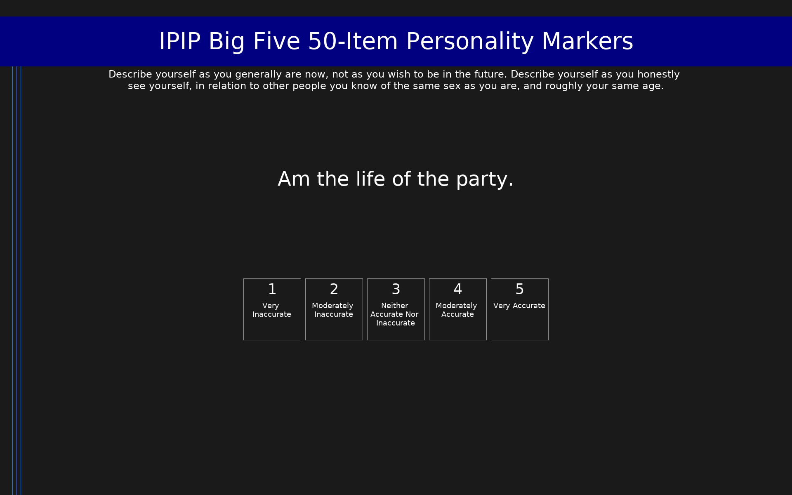

# IPIP Big Five 50-Item Personality Markers (IPIP-50)

50-item IPIP measure of the Big Five personality domains (10 items per domain). Mean-scored, range 1-5 per domain.

## Overview

- **Code:** `IPIP-Big5-50`
- **Items:** 0
- **Languages:** en
- **Version:** 1.0
- **License:** Public Domain

## Dimensions

| ID | Name | Description |
|----|------|-------------|
| `extraversion` | Extraversion |  |
| `agreeableness` | Agreeableness |  |
| `conscientiousness` | Conscientiousness |  |
| `neuroticism` | Neuroticism |  |
| `openness` | Openness to Experience |  |

## Questions

## Scoring

- **extraversion**: mean_coded (10 items)
  - Mean of 10 items after reverse coding (range 1-5). Higher scores = greater extraversion.
- **agreeableness**: mean_coded (10 items)
  - Mean of 10 items after reverse coding (range 1-5). Higher scores = greater agreeableness.
- **conscientiousness**: mean_coded (10 items)
  - Mean of 10 items after reverse coding (range 1-5). Higher scores = greater conscientiousness.
- **neuroticism**: mean_coded (10 items)
  - Mean of 10 items after reverse coding (range 1-5). Higher scores = greater neuroticism. Note: IPIP keys these as Emotional Stability; coding is inverted here so higher = more neurotic.
- **openness**: mean_coded (10 items)
  - Mean of 10 items after reverse coding (range 1-5). Higher scores = greater openness to experience.

## Citation

Goldberg, L. R. (1992). The development of markers for the Big-Five factor structure. Psychological Assessment, 4(1), 26-42. https://doi.org/10.1037/1040-3590.4.1.26

**URL:** https://ipip.ori.org/new_ipip-50-item-scale.htm

## Files

- `IPIP-Big5-50.en.json`
- `IPIP-Big5-50.json`
- `README.md`
- `screenshot.png`

---
*This README was auto-generated by `tools/generate_readmes.py`.*
