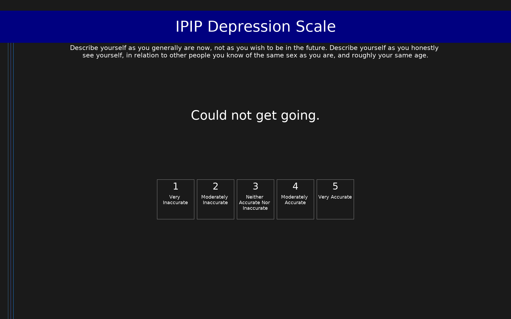

# IPIP Depression Scale (IPIP-DEP)

IPIP items measuring depressive symptoms, designed to approximate the CES-D.

## Overview

- **Code:** `IPIP-Depression`
- **Items:** 0
- **Languages:** en
- **Version:** 1.0
- **License:** Public Domain

## Dimensions

| ID | Name | Description |
|----|------|-------------|
| `depression` | Depression |  |

## Questions

## Scoring

- **depression**: sum_coded (22 items)
  - Cronbach's alpha = 0.93

## Citation

Radloff, L. S. (1977). The CES-D Scale: A self-report depression scale for research in the general population. Applied Psychological Measurement, 1(3), 385-401.

**URL:** https://ipip.ori.org/newSingleConstructsKey.htm#Depression

## Files

- `IPIP-Depression.en.json`
- `IPIP-Depression.json`
- `screenshot.png`

---
*This README was auto-generated by `tools/generate_readmes.py`.*
