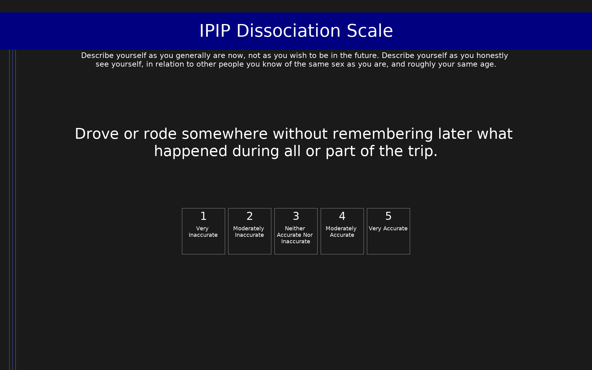

# IPIP Dissociation Scale (IPIP-DIS)

IPIP items measuring dissociative experiences.

## Overview

- **Code:** `IPIP-Dissociation`
- **Items:** 0
- **Languages:** en
- **Version:** 1.0
- **License:** Public Domain

## Dimensions

| ID | Name | Description |
|----|------|-------------|
| `dissociation` | Dissociation |  |

## Questions

## Scoring

- **dissociation**: sum_coded (31 items)
  - Cronbach's alpha = 0.90

## Citation

Goldberg, L. R. (1999). The Curious Experiences Survey: A revised version of the Dissociative Experiences Scale.

**URL:** https://ipip.ori.org/newSingleConstructsKey.htm

## Files

- `IPIP-Dissociation.en.json`
- `IPIP-Dissociation.json`
- `screenshot.png`

---
*This README was auto-generated by `tools/generate_readmes.py`.*
