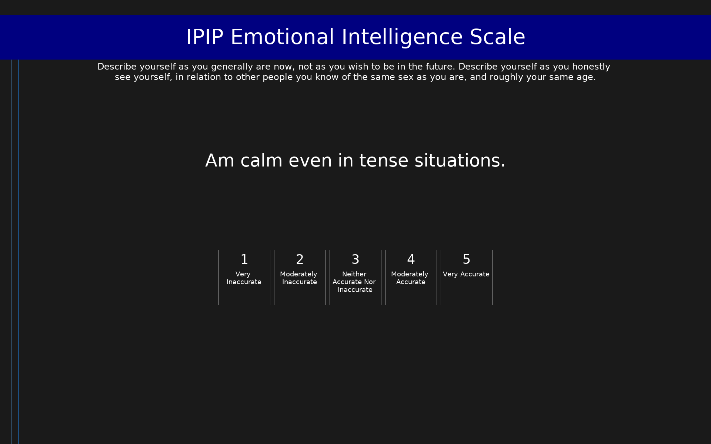

# IPIP Emotional Intelligence Scale (IPIP-EI)

IPIP representation of emotional intelligence components including empathy, emotional expressivity, and emotion-based decision making.

## Overview

- **Code:** `IPIP-EI`
- **Items:** 0
- **Languages:** en
- **Version:** 1.0
- **License:** Public Domain

## Dimensions

| ID | Name | Description |
|----|------|-------------|
| `responsive_distress` | Responsive Distress |  |
| `empathy` | Empathy |  |
| `attention_to_emotions` | Attention to Emotions |  |
| `responsive_joy` | Responsive Joy |  |
| `emotionbased_decisionmaking` | Emotion-based Decision-making |  |
| `negative_expressivity` | Negative Expressivity |  |
| `positive_expressivity` | Positive Expressivity |  |

## Questions

## Scoring

- **responsive_distress**: mean_coded (10 items)
- **empathy**: mean_coded (10 items)
- **attention_to_emotions**: mean_coded (10 items)
- **responsive_joy**: mean_coded (10 items)
- **emotionbased_decisionmaking**: mean_coded (9 items)
- **negative_expressivity**: mean_coded (10 items)
- **positive_expressivity**: mean_coded (9 items)

## Citation

Barchard, K. A. (2001). Emotional and social intelligence: Examining its place in the nomological network. Unpublished doctoral dissertation, University of British Columbia.

**URL:** https://ipip.ori.org/newEmotionalIntelligenceKey.htm

## Files

- `IPIP-EI.en.json`
- `IPIP-EI.json`
- `screenshot.png`

---
*This README was auto-generated by `tools/generate_readmes.py`.*
