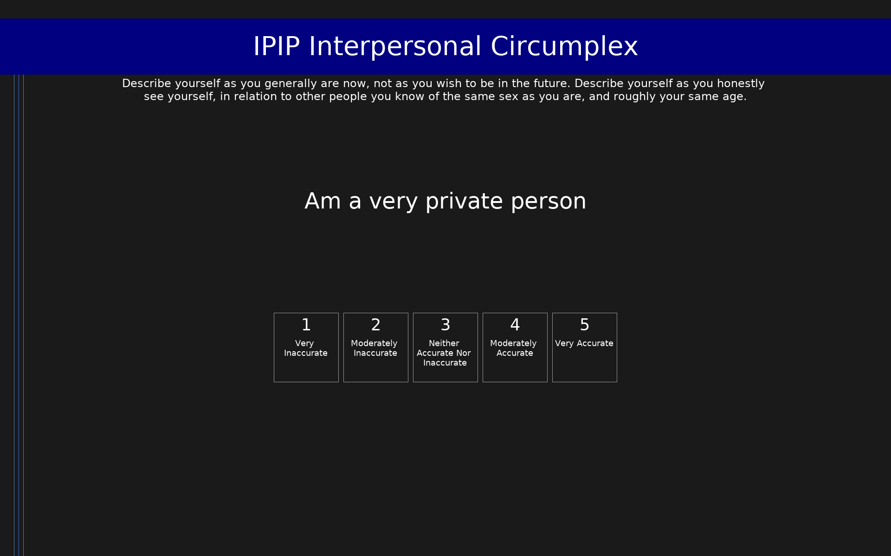

# IPIP Interpersonal Circumplex (IPIP-IPC)

IPIP Interpersonal Circumplex scales measuring 8 interpersonal styles.

## Overview

- **Code:** `IPIP-IPC`
- **Items:** 0
- **Languages:** en
- **Version:** 1.0
- **License:** Public Domain

## Dimensions

| ID | Name | Description |
|----|------|-------------|
| `introversion` | Introversion |  |
| `warmth` | Warmth |  |
| `callousness` | Callousness |  |
| `disparagement` | Disparagement |  |
| `dominance` | Dominance |  |
| `submissiveness` | Submissiveness |  |
| `gregariousness` | Gregariousness |  |
| `tolerance` | Tolerance |  |

## Questions

## Scoring

- **introversion**: mean_coded (4 items)
- **warmth**: mean_coded (4 items)
- **callousness**: mean_coded (4 items)
- **disparagement**: mean_coded (4 items)
- **dominance**: mean_coded (4 items)
- **submissiveness**: mean_coded (4 items)
- **gregariousness**: mean_coded (4 items)
- **tolerance**: mean_coded (4 items)

## Citation

Markey, P. M., & Markey, C. N. (2009). A brief assessment of the Interpersonal Circumplex: The IPIP-IPC. Assessment, 16(4), 352-361.

**URL:** https://ipip.ori.org/newIPIP-IPCScales.htm

## Files

- `IPIP-IPC.en.json`
- `IPIP-IPC.json`
- `screenshot.png`

---
*This README was auto-generated by `tools/generate_readmes.py`.*
