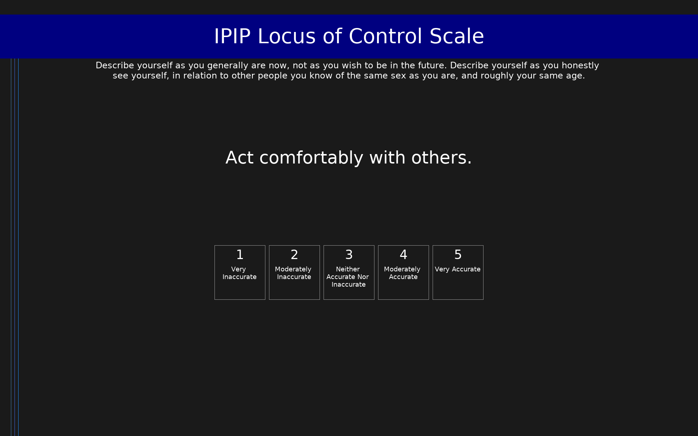

# IPIP Locus of Control Scale (IPIP-LOC)

IPIP representation of Levenson's Locus of Control scales measuring Internal, Powerful Others, and Chance orientations.

## Overview

- **Code:** `IPIP-LOC`
- **Items:** 0
- **Languages:** en
- **Version:** 1.0
- **License:** Public Domain

## Dimensions

| ID | Name | Description |
|----|------|-------------|
| `locus_of_control` | Locus of Control |  |
| `locus_of_control_internal` | Locus of Control,Internal |  |
| `locus_of_control_chance` | Locus of Control,Chance |  |
| `locus_of_control_rational` | Locus of Control,Rational |  |
| `locus_of_control_external` | Locus of Control,External |  |

## Questions

## Scoring

- **locus_of_control**: mean_coded (20 items)
  - Cronbach's alpha = 0.86
- **locus_of_control_internal**: mean_coded (10 items)
  - Cronbach's alpha = 0.71
- **locus_of_control_chance**: mean_coded (10 items)
  - Cronbach's alpha = 0.72
- **locus_of_control_rational**: mean_coded (5 items)
  - Cronbach's alpha = 0.61
- **locus_of_control_external**: mean_coded (10 items)
  - Cronbach's alpha = 0.81

## Citation

Levenson, H. (1981). Differentiating among internality, powerful others, and chance. In H. M. Lefcourt (Ed.), Research with the Locus of Control Construct (Vol. 1, pp. 15-63). Academic Press.

**URL:** https://ipip.ori.org/newSingleConstructsKey.htm#Internality

## Files

- `IPIP-LOC.en.json`
- `IPIP-LOC.json`
- `screenshot.png`

---
*This README was auto-generated by `tools/generate_readmes.py`.*
