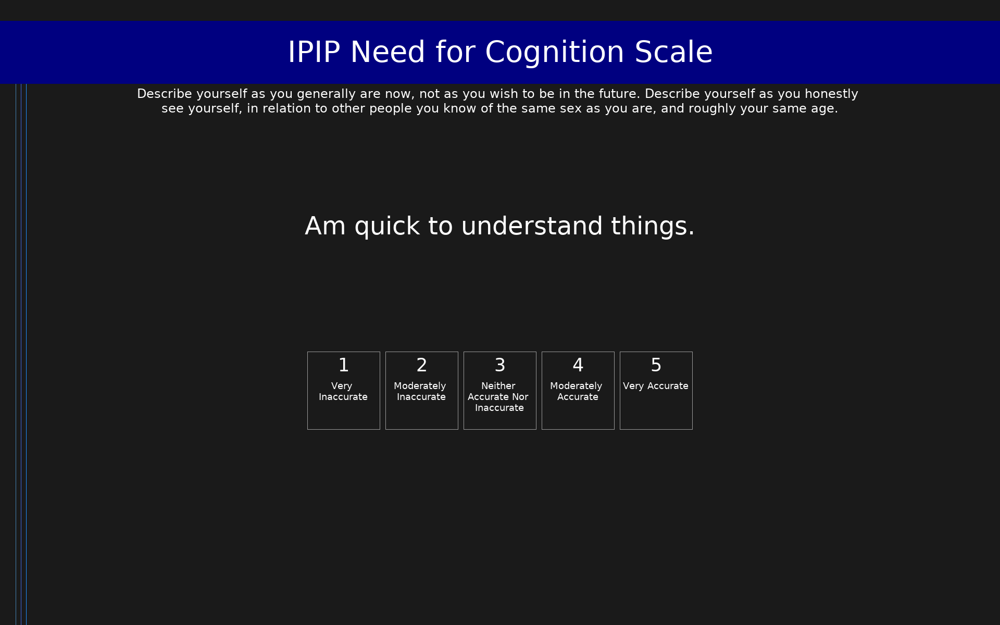

# IPIP Need for Cognition Scale (IPIP-NFC)

IPIP representation of the Need for Cognition scale measuring tendency to engage in and enjoy effortful thinking.

## Overview

- **Code:** `IPIP-NFC`
- **Items:** 0
- **Languages:** en
- **Version:** 1.0
- **License:** Public Domain

## Dimensions

| ID | Name | Description |
|----|------|-------------|
| `need_for_cognition` | Need for Cognition |  |

## Questions

## Scoring

- **need_for_cognition**: sum_coded (10 items)
  - Cronbach's alpha = 0.93

## Citation

Cacioppo, J. T., & Petty, R. E. (1982). The need for cognition. Journal of Personality and Social Psychology, 42(1), 116-131.

**URL:** https://ipip.ori.org/newSingleConstructsKey.htm#Need-for-Cognition

## Files

- `IPIP-NFC.en.json`
- `IPIP-NFC.json`
- `screenshot.png`

---
*This README was auto-generated by `tools/generate_readmes.py`.*
