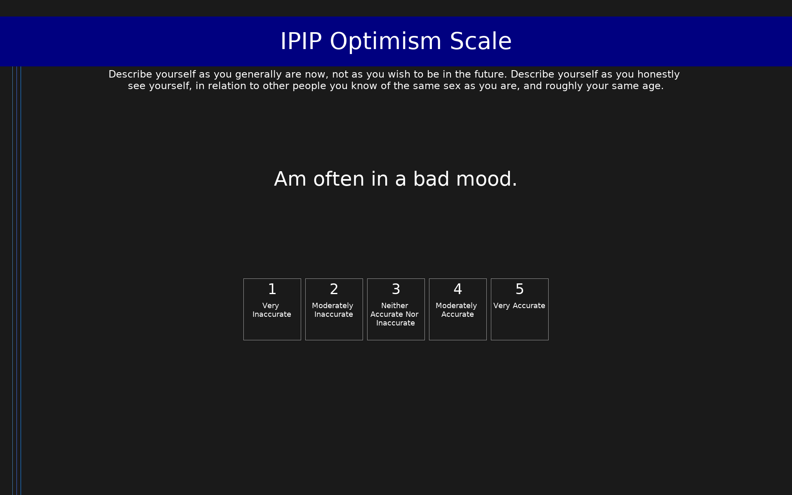

# IPIP Optimism Scale (IPIP-OPT)

IPIP items measuring dispositional optimism, designed to approximate the LOT-R.

## Overview

- **Code:** `IPIP-Optimism`
- **Items:** 0
- **Languages:** en
- **Version:** 1.0
- **License:** Public Domain

## Dimensions

| ID | Name | Description |
|----|------|-------------|
| `hope_optimism` | Hope/Optimism |  |

## Questions

## Scoring

- **hope_optimism**: sum_coded (9 items)
  - Cronbach's alpha = 0.86

## Citation

Scheier, M. F., Carver, C. S., & Bridges, M. W. (1994). Distinguishing optimism from neuroticism. Journal of Personality and Social Psychology, 67(6), 1063-1078.

**URL:** https://ipip.ori.org/newSingleConstructsKey.htm#Hope/Optimism

## Files

- `IPIP-Optimism.en.json`
- `IPIP-Optimism.json`
- `screenshot.png`

---
*This README was auto-generated by `tools/generate_readmes.py`.*
