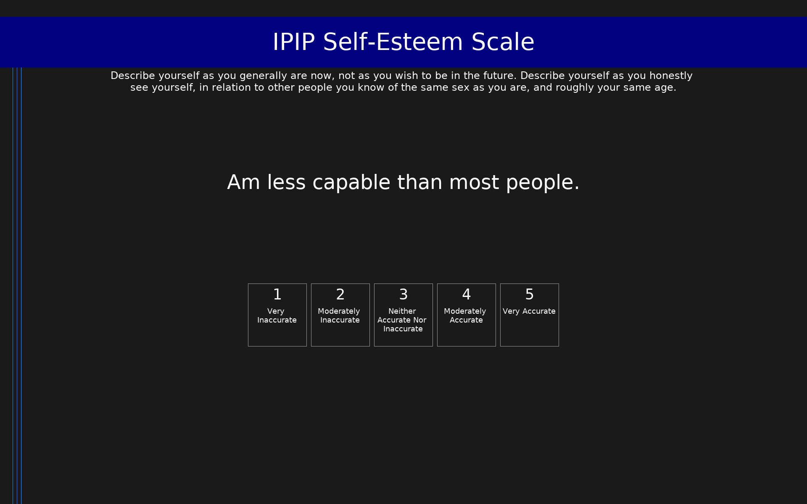

# IPIP Self-Esteem Scale (IPIP-SE)

IPIP items measuring self-esteem, designed to approximate the Rosenberg Self-Esteem Scale.

## Overview

- **Code:** `IPIP-SelfEsteem`
- **Items:** 0
- **Languages:** en
- **Version:** 1.0
- **License:** Public Domain

## Dimensions

| ID | Name | Description |
|----|------|-------------|
| `selfesteem` | Self-esteem |  |

## Questions

## Scoring

- **selfesteem**: sum_coded (10 items)
  - Cronbach's alpha = 0.84

## Citation

Rosenberg, M. (1965). Society and the Adolescent Self-Image. Princeton University Press.

**URL:** https://ipip.ori.org/newSingleConstructsKey.htm#Self-esteem

## Files

- `IPIP-SelfEsteem.en.json`
- `IPIP-SelfEsteem.json`
- `screenshot.png`

---
*This README was auto-generated by `tools/generate_readmes.py`.*
