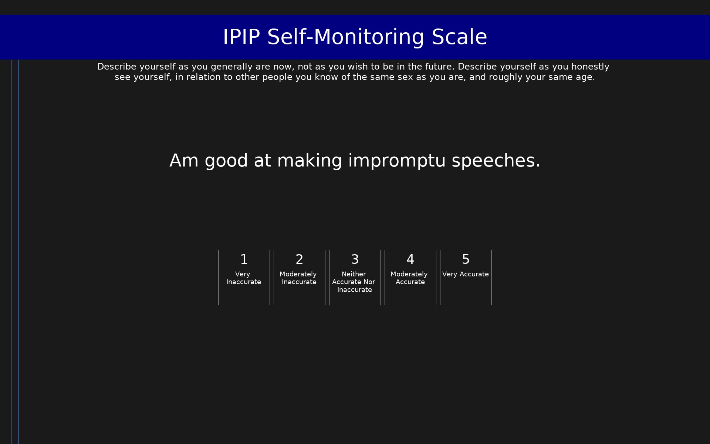

# IPIP Self-Monitoring Scale (IPIP-SM)

IPIP items measuring self-monitoring tendencies.

## Overview

- **Code:** `IPIP-SelfMonitoring`
- **Items:** 0
- **Languages:** en
- **Version:** 1.0
- **License:** Public Domain

## Dimensions

| ID | Name | Description |
|----|------|-------------|
| `selfmonitoring` | Self-monitoring |  |

## Questions

## Scoring

- **selfmonitoring**: sum_coded (10 items)
  - Cronbach's alpha = 0.82

## Citation

Snyder, M. (1974). Self-monitoring of expressive behavior. Journal of Personality and Social Psychology, 30(4), 526-537.

**URL:** https://ipip.ori.org/newSingleConstructsKey.htm#Self-monitoring

## Files

- `IPIP-SelfMonitoring.en.json`
- `IPIP-SelfMonitoring.json`
- `screenshot.png`

---
*This README was auto-generated by `tools/generate_readmes.py`.*
