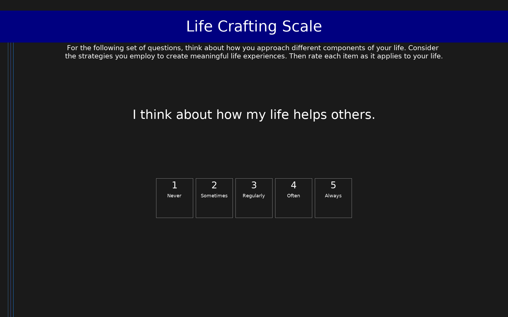

# Life Crafting Scale (LCS)

9-item self-report measure of life crafting behaviors across cognitive meaning-making, social support seeking, and challenge seeking dimensions.

## Overview

- **Code:** `LCS`
- **Items:** 0
- **Languages:** en
- **Version:** 1.0
- **License:** CC BY 4.0

## Dimensions

| ID | Name | Description |
|----|------|-------------|
| `past_reflection` | Past Reflection | Reflecting on how one's life and actions contribute to others and society (cognitive crafting). Higher scores indicate more frequent cognitive meaning-making. |
| `social_crafting` | Social Crafting | Seeking social support and drawing on relationships when facing difficulties. Higher scores indicate more active social crafting behaviors. |
| `future_planning` | Future Planning | Seeking challenges and opportunities for growth and personal development. Higher scores indicate more active challenge-seeking behaviors. |

## Questions

## Scoring

- **past_reflection**: mean (3 items)
  - Mean of items 1-3 (cognitive crafting: thinking about how life helps others and contributes to society).
- **social_crafting**: mean (3 items)
  - Mean of items 4-6 (seeking social support: asking for advice and support from family and others).
- **future_planning**: mean (3 items)
  - Mean of items 7-9 (seeking challenges: working hard on challenging activities and seeking new opportunities for growth).

## Citation

Chen, S., van der Meij, L., van Zyl, L. E., & Demerouti, E. (2022). The Life Crafting Scale: Development and validation of a multi-dimensional meaning-making measure. Frontiers in Psychology, 13, 795686. https://doi.org/10.3389/fpsyg.2022.795686

**URL:** https://doi.org/10.3389/fpsyg.2022.795686

## Files

- `LCS.en.json`
- `LCS.json`
- `screenshot.png`

---
*This README was auto-generated by `tools/generate_readmes.py`.*
