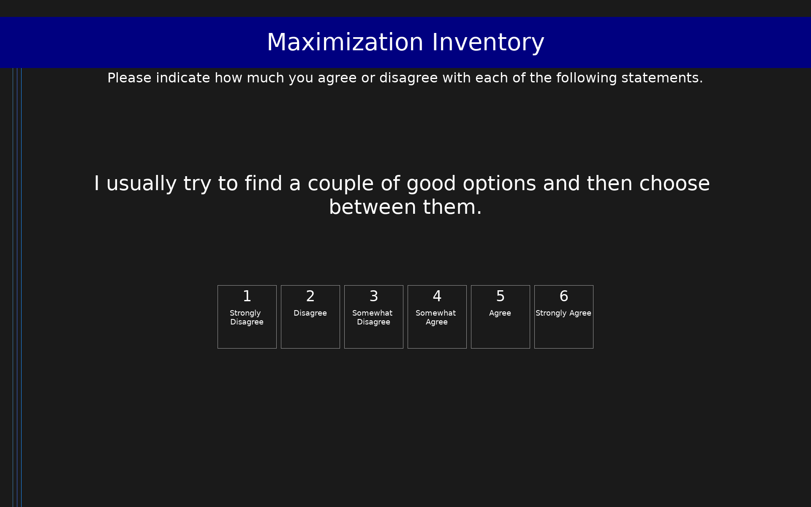

# Maximization Inventory (MI)

34-item measure of maximizing tendency comprising three separate subscales: Alternative Search (12 items), Decision Difficulty (12 items), and Satisficing (10 items). The subscales should not be summed into a total score; they measure distinct and theoretically separable components of maximizing behavior.

## Overview

- **Code:** `MI`
- **Items:** 0
- **Languages:** en
- **Version:** 1.0
- **License:** CC BY 4.0

## Dimensions

| ID | Name | Description |
|----|------|-------------|
| `satisficing` | Satisficing |  |
| `decision_difficulty` | Decision Difficulty |  |
| `alt_search` | Alternative Search |  |

## Questions

## Scoring

- **satisficing**: mean_coded (10 items)
  - Mean of Satisficing items (1-6). Higher scores indicate greater satisficing tendency (comfort with good-enough decisions). Items 1-10 from the original MI numbering.
- **decision_difficulty**: mean_coded (12 items)
  - Mean of Decision Difficulty items (1-6) after reverse-coding item 22. Higher scores indicate greater difficulty making decisions. Items 11-22 from the original MI numbering; item 22 is reverse-scored.
- **alt_search**: mean_coded (12 items)
  - Mean of Alternative Search items (1-6). Higher scores indicate a greater tendency to search for all alternatives before deciding. Items 23-34 from the original MI numbering.

## Citation

Turner, B. M., Rim, H. B., Betz, N. E., & Nygren, T. E. (2012). The Maximization Inventory. Judgment and Decision Making, 7(1), 48-60.

**URL:** https://journal.sjdm.org/11/11914/jdm11914.pdf

## Files

- `MI.en.json`
- `MI.json`
- `screenshot.png`

---
*This README was auto-generated by `tools/generate_readmes.py`.*
