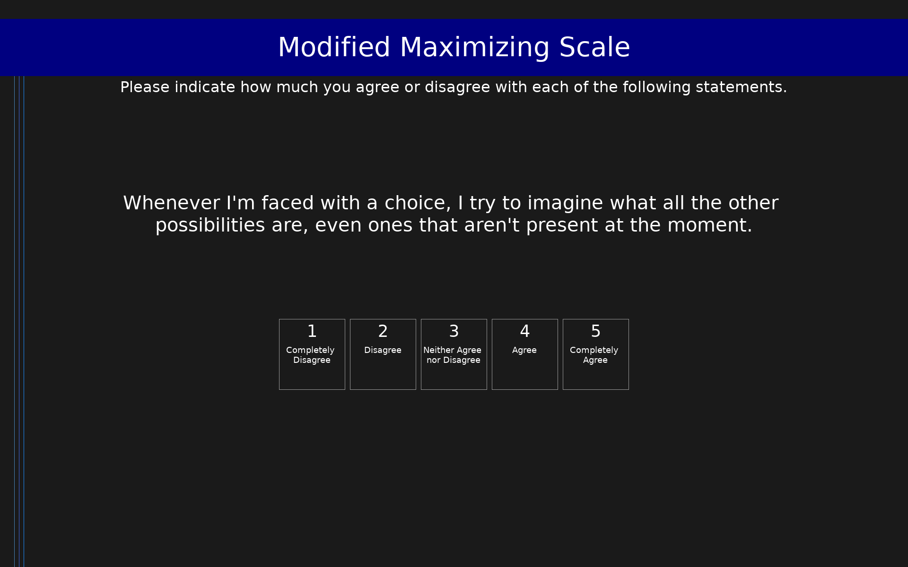

# Modified Maximizing Scale (MMS)

5-item measure of maximizing tendency that excludes the decision difficulty component present in earlier scales. Developed to reduce the confound between maximizing and depressive symptomatology. All items are content-free (not tied to specific consumer situations) and load on a single factor reflecting aspirations for high standards and extensive alternative search. The scale is typically treated as unidimensional, though items reflect two related facets: High Standards and Alternative Search.

## Overview

- **Code:** `MMS`
- **Items:** 0
- **Languages:** en
- **Version:** 1.0
- **License:** CC BY 4.0

## Dimensions

| ID | Name | Description |
|----|------|-------------|
| `maximizing` | Maximizing |  |

## Questions

## Scoring

- **maximizing**: mean_coded (5 items)
  - Mean of all 5 items (1-5). Higher scores indicate greater maximizing tendency (high standards combined with extensive alternative search), without the decision difficulty component. Cronbach's alpha ranged from .65 to .77 across three development samples.

## Citation

Lai, L. (2010). Maximizing without difficulty: A modified maximizing scale and its correlates. Judgment and Decision Making, 5(3), 164-175.

**URL:** https://journal.sjdm.org/10/10219/jdm10219.pdf

## Files

- `MMS.en.json`
- `MMS.json`
- `screenshot.png`

---
*This README was auto-generated by `tools/generate_readmes.py`.*
