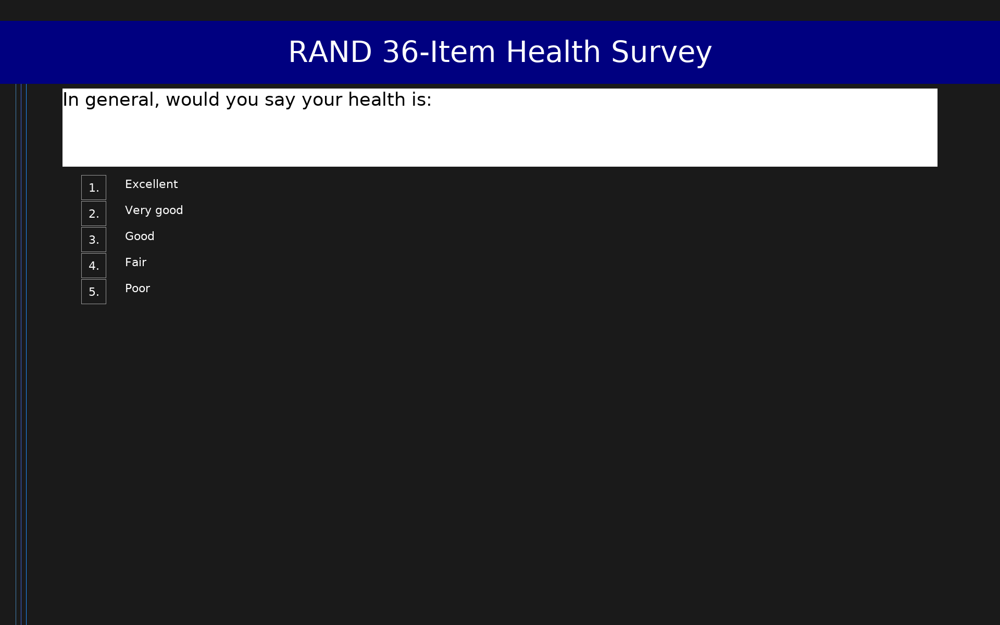

# RAND 36-Item Health Survey (SF-36)

36-item health survey measuring 8 dimensions of health. Items use multiple response formats; standard RAND 0–100 subscale scoring requires post-hoc recoding in R/Python. The framework sum_coded scores are relative indicators only (higher = better health). See RAND SF-36 scoring manual for official 0–100 transformation.

## Overview

- **Code:** `SF36`
- **Items:** 0
- **Languages:** en
- **Version:** 1.0
- **License:** Public Domain (RAND Corporation)

## Dimensions

| ID | Name | Description |
|----|------|-------------|
| `pf` | Physical Functioning | Extent to which health limits physical activities. Range: 10–30 (higher = less limitation). |
| `rp` | Role Limitations – Physical | Extent to which physical health limits work/daily activities. Range: 0–4 (higher = fewer limitations). |
| `re` | Role Limitations – Emotional | Extent to which emotional problems limit work/daily activities. Range: 0–3 (higher = fewer limitations). |
| `ef` | Energy/Fatigue | Level of energy and fatigue (Vitality). Range: 4–24 (higher = more vitality). |
| `ewb` | Emotional Well-Being | Extent of anxiety and depression. Range: 5–30 (higher = better mental health). |
| `sf` | Social Functioning | Extent to which health problems interfere with social activities. Range: 2–10 (higher = less interference). |
| `pain` | Pain | Intensity of pain and its interference with normal activities. Range: 2–11 (higher = less pain). |
| `gh` | General Health | Personal evaluation of health, including current health, health outlook, and resistance to illness. Range: 5–25 (higher = better perceived health). |

## Questions

## Scoring

- **pf**: sum_coded (10 items)
  - Sum of 10 physical functioning items (range 10–30; higher = less limited). For RAND 0–100 score: (sum - 10) / 20 * 100.
- **rp**: sum_coded (4 items)
  - Sum of 4 role-physical items (range 0–4; higher = fewer limitations). Values: Yes=0, No=1. For RAND 0–100: sum / 4 * 100.
- **re**: sum_coded (3 items)
  - Sum of 3 role-emotional items (range 0–3; higher = fewer limitations). Values: Yes=0, No=1. For RAND 0–100: sum / 3 * 100.
- **ef**: sum_coded (4 items)
  - Energy/Fatigue (Vitality): sum of 4 items (range 4–24; higher = more energy). Positive items (pep, energy) use -1 coding; negative items (worn out, tired) use +1. For RAND 0–100: requires item-by-item recoding per RAND manual.
- **ewb**: sum_coded (5 items)
  - Emotional Well-Being (Mental Health): sum of 5 items (range 5–30; higher = better mental health). Negative symptoms (nervous, blue) use +1; positive states (calm, happy) use -1. For RAND 0–100: requires item-by-item recoding per RAND manual.
- **sf**: sum_coded (2 items)
  - Social Functioning: sum of 2 items (range 2–10; higher = less interference). Option values pre-reversed so +1 coding applies to both. For RAND 0–100: requires item-by-item recoding per RAND manual.
- **pain**: sum_coded (2 items)
  - Bodily Pain: sum of 2 items (range 2–11; higher = less pain). Option values pre-reversed so +1 coding applies to both. For RAND 0–100: requires item-by-item recoding per RAND manual.
- **gh**: sum_coded (5 items)
  - General Health: sum of 5 items (range 5–25; higher = better perceived health). Option values pre-reversed where needed so +1 coding applies to all. For RAND 0–100: requires item-by-item recoding per RAND manual.

## Citation

Hays, R. D., Sherbourne, C. D., & Mazel, R. M. (1993). The RAND 36-Item Health Survey 1.0. Health Economics, 2(3), 217–227. https://doi.org/10.1002/hec.4730020305

**URL:** https://www.rand.org/health/surveys_tools/mos/36-item-short-form.html

## Files

- `SF36.en.json`
- `SF36.json`
- `screenshot.png`

---
*This README was auto-generated by `tools/generate_readmes.py`.*
