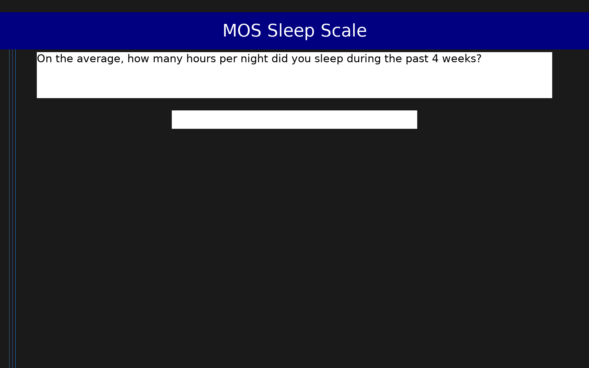

# MOS Sleep Scale (MOS-Sleep)

12-item scale measuring sleep quality and quantity across six dimensions, developed from the Medical Outcomes Study. Items use mixed response formats: one free-text numeric entry (hours), one multiple-choice (minutes to fall asleep), and ten 6-point frequency items. Subscales cover sleep disturbance, adequacy, somnolence, respiratory problems, sleep quantity, and sleep onset latency.

## Overview

- **Code:** `MOSSLP`
- **Items:** 0
- **Languages:** en
- **Version:** 1.0
- **License:** Public Domain (RAND Corporation)

## Dimensions

| ID | Name | Description |
|----|------|-------------|
| `sleep_disturbance` | Sleep Disturbance | Frequency of difficulty initiating and maintaining sleep, and restless/unquiet sleep. Items: mosslp3, mosslp4, mosslp5. Higher sum = more frequent disturbance (worse sleep). |
| `sleep_adequacy` | Sleep Adequacy | Frequency of feeling rested upon waking and getting the amount of sleep needed. Items: mosslp6, mosslp7. Higher sum = more adequate sleep (better sleep). |
| `somnolence` | Somnolence | Frequency of daytime drowsiness and trouble staying awake. Items: mosslp8, mosslp9. Higher sum = more daytime sleepiness (worse). |
| `respiratory` | Respiratory Problems | Frequency of snoring and breathing difficulties during sleep. Items: mosslp10, mosslp11. Higher sum = more frequent respiratory problems during sleep (worse). |
| `sleep_quantity` | Sleep Quantity | Average hours of sleep per night (free numeric entry). Not transformed; reflects raw hours reported. |
| `sleep_onset` | Sleep Onset Latency | Categorical rating of minutes typically taken to fall asleep (1 = 0–15 min to 5 = more than 60 min). Higher value = longer sleep onset latency (worse). |

## Questions

## Scoring

- **sleep_disturbance**: sum_coded (3 items)
  - Sum of sleep problem frequency items (range 3–18); higher = more frequent sleep disturbance (worse sleep). Items: trouble falling asleep (mosslp3), waking and trouble falling back asleep (mosslp4), unquiet sleep (mosslp5).
- **sleep_adequacy**: sum_coded (2 items)
  - Sum of sleep adequacy items (range 2–12); higher = more adequate sleep (better). Items: feeling rested upon waking (mosslp6), getting the amount of sleep needed (mosslp7). Note: response scale runs from 'All of the time' (1) to 'None of the time' (6), so higher raw scores indicate less adequacy; interpret accordingly or reverse outside the framework.
- **somnolence**: sum_coded (2 items)
  - Sum of daytime sleepiness items (range 2–12); higher = more frequent daytime somnolence (worse). Items: drowsy or sleepy during the day (mosslp8), trouble staying awake during the day (mosslp9).
- **respiratory**: sum_coded (2 items)
  - Sum of respiratory problem items (range 2–12); higher = more frequent respiratory problems during sleep (worse). Items: snoring (mosslp10), difficulty breathing or stopping breathing (mosslp11).
- **sleep_quantity**: sum_coded (1 items)
  - Average hours of sleep per night during the past 4 weeks (free numeric entry; not transformed). Higher = more hours of sleep.
- **sleep_onset**: sum_coded (1 items)
  - Minutes to fall asleep category (1 = 0–15 min, 2 = 16–30 min, 3 = 31–45 min, 4 = 46–60 min, 5 = more than 60 min); higher = longer sleep onset latency (worse).

## Citation

Hays, R. D., & Stewart, A. L. (1992). Sleep measures. In A. L. Stewart & J. E. Ware Jr. (Eds.), Measuring Functioning and Well-Being (pp. 235–259). Duke University Press. See also: Spritzer, K. L., & Hays, R. D. (2003). MOS Sleep Scale: A Manual for Use and Scoring, Version 1.0. RAND.

**URL:** https://www.rand.org/health-care/surveys_tools/mos/sleep-scale.html

## Files

- `MOSSLP.en.json`
- `MOSSLP.json`
- `screenshot.png`

---
*This README was auto-generated by `tools/generate_readmes.py`.*
