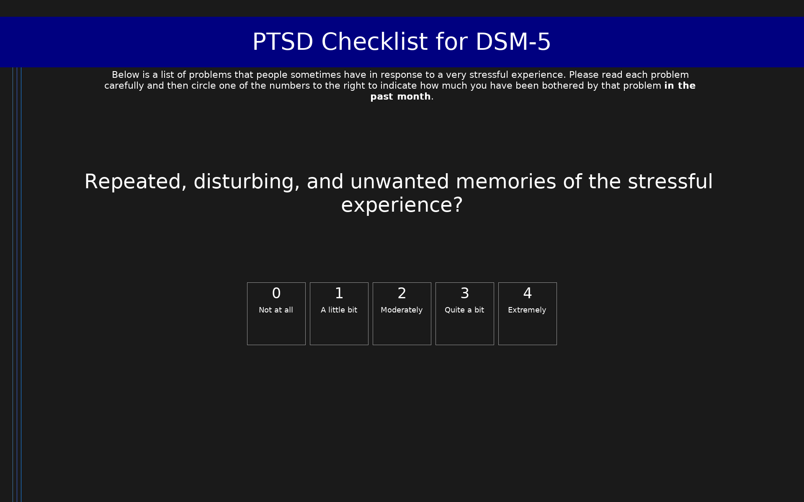

# PTSD Checklist for DSM-5 (PCL-5)

20-item self-report measure of PTSD symptoms over the past month, aligned with DSM-5 criteria. Scores range from 0 to 80, with a provisional PTSD diagnosis suggested at a score of 31-33 or higher.

## Overview

- **Code:** `PCL5`
- **Items:** 0
- **Languages:** en
- **Version:** 1.0
- **License:** Public Domain (U.S. Government work)

## Dimensions

| ID | Name | Description |
|----|------|-------------|
| `intrusion` | Intrusion (Criterion B) |  |
| `avoidance` | Avoidance (Criterion C) |  |
| `cognition` | Negative Alterations in Cognition and Mood (Criterion D) |  |
| `arousal` | Alterations in Arousal and Reactivity (Criterion E) |  |
| `total` | Total PTSD Severity |  |

## Questions

## Scoring

- **intrusion**: sum_coded (5 items)
  - Sum of Criterion B intrusion items (0-20).
- **avoidance**: sum_coded (2 items)
  - Sum of Criterion C avoidance items (0-8).
- **cognition**: sum_coded (7 items)
  - Sum of Criterion D negative cognition and mood items (0-28).
- **arousal**: sum_coded (6 items)
  - Sum of Criterion E arousal and reactivity items (0-24).
- **total**: sum_coded (20 items)
  - Sum of all 20 items (0-80). A score of 31-33 or higher is suggested as a threshold for probable PTSD.

## Citation

Weathers, F. W., Litz, B. T., Keane, T. M., Palmieri, P. A., Marx, B. P., & Schnurr, P. P. (2013). The PTSD Checklist for DSM-5 (PCL-5). National Center for PTSD. Available at: https://www.ptsd.va.gov

**URL:** https://www.ptsd.va.gov/professional/assessment/adult-sr/ptsd-checklist.asp

## Files

- `PCL5.en.json`
- `PCL5.json`
- `README.md`
- `screenshot.png`

---
*This README was auto-generated by `tools/generate_readmes.py`.*
