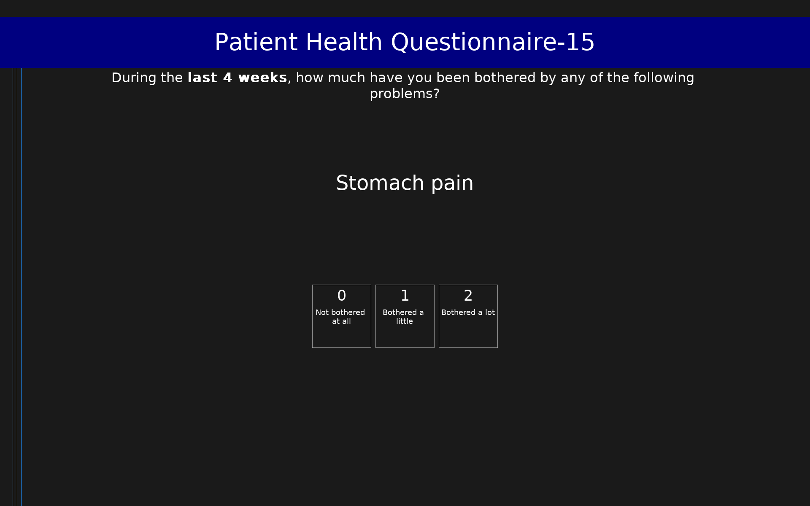

# Patient Health Questionnaire-15 (PHQ-15)

15-item somatic symptom severity measure. Scores range from 0 to 30. Derived from the full PHQ.

## Overview

- **Code:** `PHQ15`
- **Items:** 0
- **Languages:** en
- **Version:** 1.0
- **License:** Public Domain

## Dimensions

| ID | Name | Description |
|----|------|-------------|
| `somatic` | Somatic Symptom Severity |  |

## Questions

## Scoring

- **somatic**: sum_coded (15 items)
  - Sum of all items (0-30). Severity: 0-4 minimal, 5-9 low, 10-14 medium, ≥15 high.

## Citation

Kroenke, K., Spitzer, R. L., & Williams, J. B. (2002). The PHQ-15: Validity of a new measure for evaluating the severity of somatic symptoms. Psychosomatic Medicine, 64(2), 258-266. https://doi.org/10.1097/00006842-200203000-00008

**URL:** https://doi.org/10.1097/00006842-200203000-00008

## Files

- `PHQ15.en.json`
- `PHQ15.json`
- `README.md`
- `screenshot.png`

---
*This README was auto-generated by `tools/generate_readmes.py`.*
