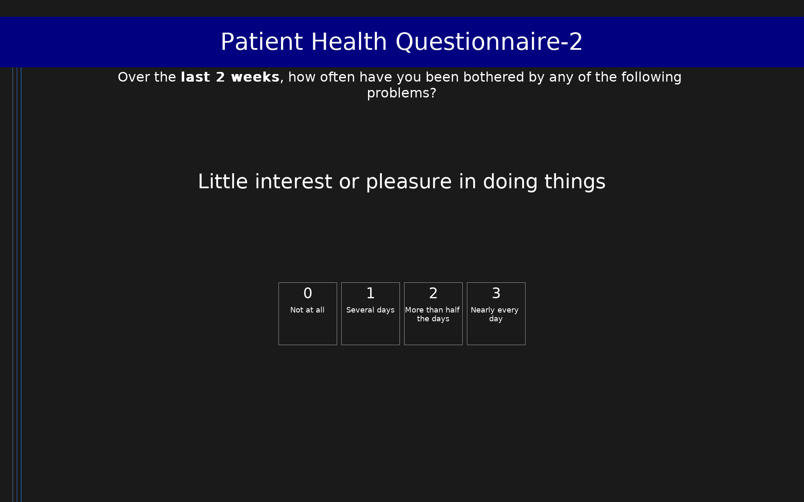

# Patient Health Questionnaire-2 (PHQ-2)

2-item ultra-brief depression screening tool. Items 1-2 of the PHQ-9. Score ≥3 = positive screen for depression.

## Overview

- **Code:** `PHQ2`
- **Items:** 0
- **Languages:** en
- **Version:** 1.0
- **License:** Public Domain

## Dimensions

| ID | Name | Description |
|----|------|-------------|
| `depression` | Depression Screen |  |

## Questions

## Scoring

- **depression**: sum_coded (2 items)
  - Sum of both items (0-6). Score ≥3 = positive screen for depression; recommend follow-up with PHQ-9.

## Citation

Kroenke, K., Spitzer, R. L., & Williams, J. B. (2003). The Patient Health Questionnaire-2: Validity of a two-item depression screener. Medical Care, 41(11), 1284-1292. https://doi.org/10.1097/01.MLR.0000093487.78664.3C

**URL:** https://doi.org/10.1097/01.MLR.0000093487.78664.3C

## Files

- `PHQ2.en.json`
- `PHQ2.json`
- `README.md`
- `screenshot.png`

---
*This README was auto-generated by `tools/generate_readmes.py`.*
