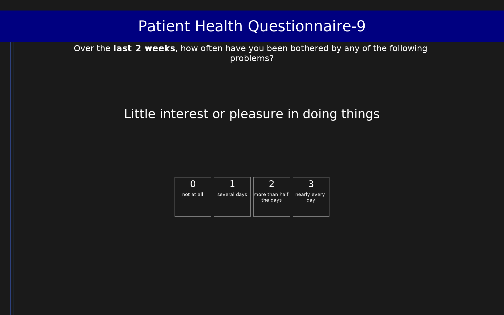

# Patient Health Questionnaire-9 (PHQ-9)

9-item depression screening tool measuring symptom severity over the past 2 weeks. Scores range from 0 to 27.

## Overview

- **Code:** `PHQ9`
- **Items:** 0
- **Languages:** en
- **Version:** 1.0
- **License:** Public Domain

## Dimensions

| ID | Name | Description |
|----|------|-------------|
| `depression` | Depression Severity |  |

## Questions

## Scoring

- **depression**: sum_coded (9 items)
  - Sum of all items (0-27). Severity: 0-4 minimal, 5-9 mild, 10-14 moderate, 15-19 moderately severe, 20-27 severe.

## Citation

Kroenke, K., Spitzer, R. L., & Williams, J. B. (2001). The PHQ-9: Validity of a brief depression severity measure. Journal of General Internal Medicine, 16(9), 606-613. https://doi.org/10.1046/j.1525-1497.2001.016009606.x

**URL:** https://doi.org/10.1046/j.1525-1497.2001.016009606.x

## Files

- `PHQ9.en.json`
- `PHQ9.json`
- `README.md`
- `screenshot.png`

---
*This README was auto-generated by `tools/generate_readmes.py`.*
