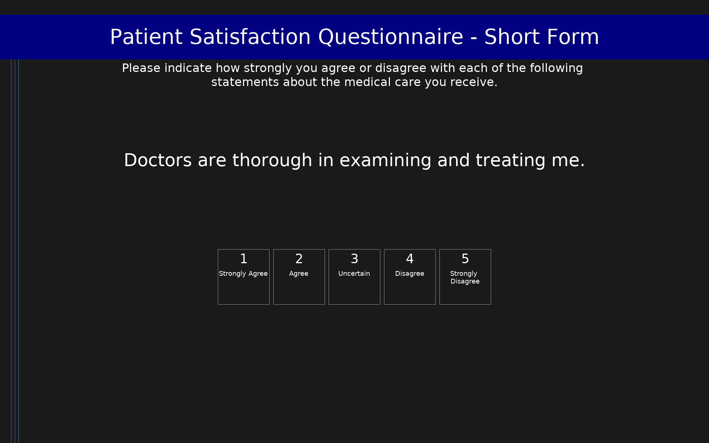

# Patient Satisfaction Questionnaire - Short Form (PSQ-18)

18-item short form of the Patient Satisfaction Questionnaire (PSQ-III) measuring patient satisfaction with medical care across 7 subscales: General Satisfaction, Technical Quality, Interpersonal Manner, Communication, Financial Aspects, Time Spent with Doctor, and Access/Convenience. Items use a 5-point agree/disagree scale. Subscale scores are means (range 1–5); higher scores indicate greater satisfaction.

## Overview

- **Code:** `PSQ18`
- **Items:** 0
- **Languages:** en
- **Version:** 1.0
- **License:** Public Domain (RAND Corporation)

## Dimensions

| ID | Name | Description |
|----|------|-------------|
| `general_satisfaction` | General Satisfaction | Overall satisfaction with medical care. Items: psq1, psq4. |
| `technical_quality` | Technical Quality | Perceived competence and skill of physicians. Items: psq2, psq6, psq10, psq15. |
| `interpersonal_manner` | Interpersonal Manner | Doctors' personal manner and respect shown to patients. Items: psq5, psq11, psq17. |
| `communication` | Communication | Quality of doctor-patient communication. Items: psq8, psq12, psq13. |
| `financial_aspects` | Financial Aspects | Satisfaction with cost and affordability of medical care. Items: psq9, psq16. |
| `time_spent` | Time Spent with Doctor | Satisfaction with availability of physicians. Items: psq18. |
| `access_convenience` | Access/Convenience | Ease of obtaining medical care when needed. Items: psq3, psq7, psq14. |

## Questions

## Scoring

- **general_satisfaction**: mean_coded (2 items)
  - Mean of 2 items (range 1–5; higher = greater satisfaction). Items 1 and 4 are positive direction; option values are pre-reversed so that Strongly Agree = 5.
- **technical_quality**: mean_coded (4 items)
  - Mean of 4 items (range 1–5; higher = greater satisfaction). Items 2 and 6 are negative direction (Strongly Agree = 1); items 10 and 15 are positive direction (Strongly Agree = 5). Option values are pre-coded for directionality.
- **interpersonal_manner**: mean_coded (3 items)
  - Mean of 3 items (range 1–5; higher = greater satisfaction). Item 5 is negative direction; items 11 and 17 are positive direction. Option values are pre-coded for directionality.
- **communication**: mean_coded (3 items)
  - Mean of 3 items (range 1–5; higher = greater satisfaction). Item 12 is negative direction; items 8 and 13 are positive direction. Option values are pre-coded for directionality.
- **financial_aspects**: mean_coded (2 items)
  - Mean of 2 items (range 1–5; higher = greater satisfaction). Item 16 is negative direction; item 9 is positive direction. Option values are pre-coded for directionality.
- **time_spent**: mean_coded (1 items)
  - Single item (range 1–5; higher = greater satisfaction). Item 18 is positive direction (Strongly Agree = 5).
- **access_convenience**: mean_coded (3 items)
  - Mean of 3 items (range 1–5; higher = greater satisfaction). Items 7 and 14 are negative direction; item 3 is positive direction. Option values are pre-coded for directionality.

## Citation

Marshall, G.N., & Hays, R.D. (1994). The Patient Satisfaction Questionnaire Short Form (PSQ-18). RAND, Santa Monica, CA. P-7865.

**URL:** https://www.rand.org/health-care/surveys_tools/psq.html

## Files

- `PSQ18.en.json`
- `PSQ18.json`
- `screenshot.png`

---
*This README was auto-generated by `tools/generate_readmes.py`.*
