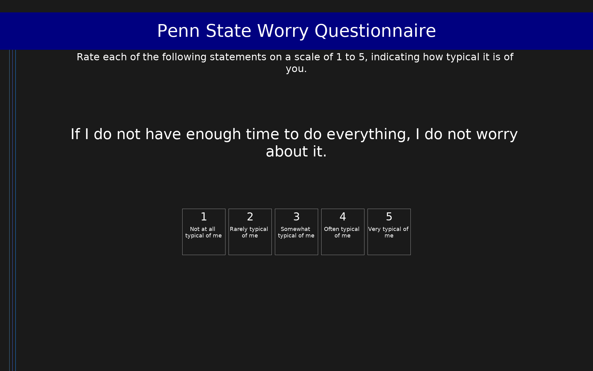

# Penn State Worry Questionnaire (PSWQ)

16-item measure of the trait of worry. Scores range from 16 to 80; higher scores indicate greater worry severity.

## Overview

- **Code:** `PSWQ`
- **Items:** 0
- **Languages:** en
- **Version:** 1.0
- **License:** Public Domain

## Dimensions

| ID | Name | Description |
|----|------|-------------|
| `worry` | Worry |  |

## Questions

## Scoring

- **worry**: sum_coded (16 items)
  - Sum of all items after reverse coding items 1, 3, 8, 10, 11 (range 16-80). Higher scores indicate greater tendency to worry.

## Citation

Meyer, T. J., Miller, M. L., Metzger, R. L., & Borkovec, T. D. (1990). Development and validation of the Penn State Worry Questionnaire. Behaviour Research and Therapy, 28(6), 487-495. https://doi.org/10.1016/0005-7967(90)90135-6

**URL:** https://doi.org/10.1016/0005-7967(90)90135-6

## Files

- `PSWQ.en.json`
- `PSWQ.json`
- `README.md`
- `screenshot.png`

---
*This README was auto-generated by `tools/generate_readmes.py`.*
