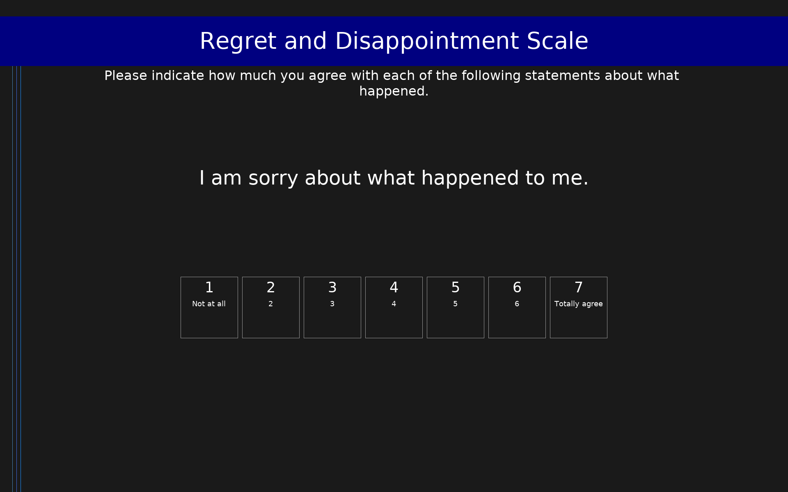

# Regret and Disappointment Scale (RDS)

7-item instrument for assessing regret and disappointment in decision making using cognitive appraisal items (without using the words 'regret' or 'disappointment'). Items distinguish self-caused negative outcomes (internal attribution, regret) from other-caused negative outcomes (external attribution, disappointment). Regret Index = mean of items 2 and 4; Disappointment Index = mean of items 3 and 5. Items rated on a 7-point scale (1 = Not at all, 7 = Totally agree). Item 7 is a forced-choice counterfactual completion.

## Overview

- **Code:** `RDS`
- **Items:** 0
- **Languages:** en
- **Version:** 1.0
- **License:** CC BY 4.0

## Dimensions

| ID | Name | Description |
|----|------|-------------|
| `rds_regret` | Regret | Self-caused negative outcomes with internal attribution (Regret Index = mean of items 2 and 4) |
| `rds_disappointment` | Disappointment | Other-caused negative outcomes with external attribution (Disappointment Index = mean of items 3 and 5) |
| `rds_affect` | Negative Affect | General negative affect and satisfaction control items (items 1 and 6) |

## Questions

## Scoring

- **rds_regret**: mean_coded (2 items)
  - Regret Index: Mean of items 2 (counterfactual wish) and 4 (internal attribution). Higher scores indicate stronger regret. Item 7 (forced-choice counterfactual: 'I had chosen differently') provides a categorical regret indicator.
- **rds_disappointment**: mean_coded (2 items)
  - Disappointment Index: Mean of items 3 (external counterfactual wish) and 5 (external attribution). Higher scores indicate stronger disappointment.

## Citation

Marcatto, F., & Ferrante, D. (2008). The Regret and Disappointment Scale: An instrument for assessing regret and disappointment in decision making. Judgment and Decision Making, 3(1), 87-99. https://doi.org/10.1017/S193029750000019X

**URL:** https://doi.org/10.1017/S193029750000019X

## Files

- `RDS.en.json`
- `RDS.json`
- `screenshot.png`

---
*This README was auto-generated by `tools/generate_readmes.py`.*
