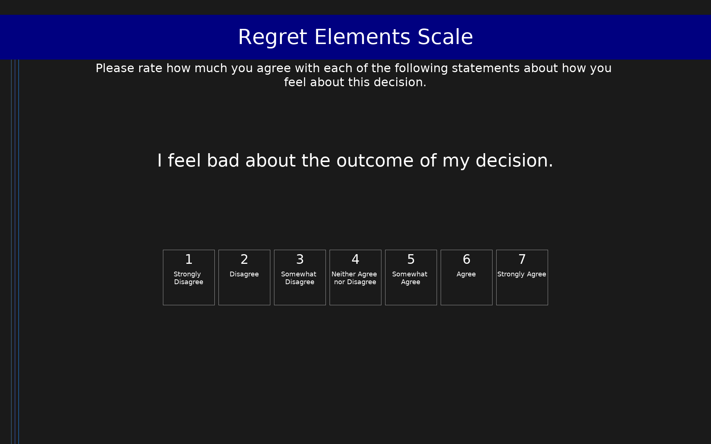

# Regret Elements Scale (RES)

10-item measure of post-decisional regret distinguishing two components: the affective element (RES-A, 5 items) capturing the emotional/feeling component of regret, and the cognitive element (RES-C, 5 items) capturing counterfactual thinking and mental simulation. Items are rated on a 7-point Likert scale (1 = Strongly Disagree, 7 = Strongly Agree). Higher subscale scores indicate stronger affective or cognitive regret.

## Overview

- **Code:** `RES`
- **Items:** 0
- **Languages:** en
- **Version:** 1.0
- **License:** CC BY 4.0

## Dimensions

| ID | Name | Description |
|----|------|-------------|
| `res_affective` | Affective Regret | Emotional/feeling component of regret associated with maladaptive affective outcomes |
| `res_cognitive` | Cognitive Regret | Cognitive/counterfactual thinking component of regret associated with functional preparatory outcomes |

## Questions

## Scoring

- **res_affective**: mean_coded (5 items)
  - Mean of 5 affective items (1-7). Higher scores indicate stronger emotional regret associated with maladaptive affective outcomes (alpha = .87).
- **res_cognitive**: mean_coded (5 items)
  - Mean of 5 cognitive items (1-7). Higher scores indicate stronger counterfactual thinking associated with functional preparatory outcomes (alpha = .89).

## Citation

Buchanan, J., Summerville, A., Lehmann, J., & Reb, J. (2016). The Regret Elements Scale: Distinguishing the affective and cognitive components of regret. Judgment and Decision Making, 11(3), 275-286. https://doi.org/10.1017/S1930297500003107

**URL:** https://doi.org/10.1017/S1930297500003107

## Files

- `RES.en.json`
- `RES.json`
- `screenshot.png`

---
*This README was auto-generated by `tools/generate_readmes.py`.*
