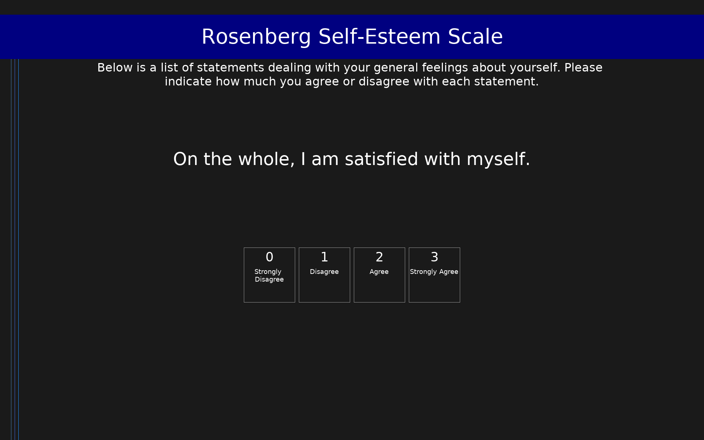

# Rosenberg Self-Esteem Scale (RSES)

10-item measure of global self-esteem. Scored 0-30 with higher scores indicating higher self-esteem.

## Overview

- **Code:** `RSES`
- **Items:** 0
- **Languages:** en
- **Version:** 1.0
- **License:** Public Domain

## Dimensions

| ID | Name | Description |
|----|------|-------------|
| `self_esteem` | Self-Esteem |  |

## Questions

## Scoring

- **self_esteem**: sum_coded (10 items)
  - Sum of all items after reverse coding (0-30). Higher scores = higher self-esteem. Scores below 15 suggest low self-esteem.

## Citation

Rosenberg, M. (1965). Society and the Adolescent Self-Image. Princeton University Press.

**URL:** https://socy.umd.edu/about-us/using-rosenberg-self-esteem-scale

## Files

- `README.md`
- `RSES.en.json`
- `RSES.json`
- `screenshot.png`

---
*This README was auto-generated by `tools/generate_readmes.py`.*
