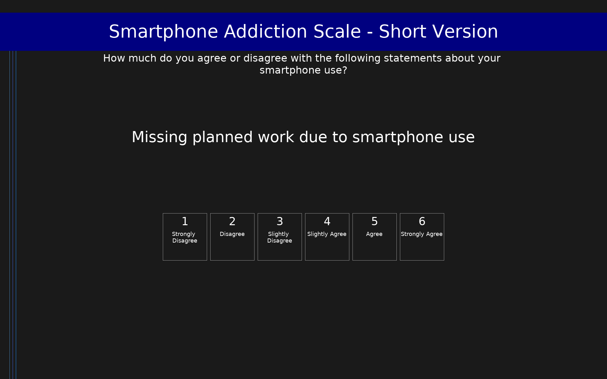

# Smartphone Addiction Scale - Short Version (SAS-SV)

10-item short version of the Smartphone Addiction Scale measuring problematic smartphone use. Scores range from 10 to 60. At-risk cutoffs: ≥31 for males, ≥33 for females.

## Overview

- **Code:** `SASV`
- **Items:** 0
- **Languages:** en
- **Version:** 1.0
- **License:** Open access (CC BY)

## Dimensions

| ID | Name | Description |
|----|------|-------------|
| `total` | Smartphone Addiction | Total problematic smartphone use score (range 10–60). At-risk cutoffs: ≥31 males, ≥33 females. |

## Questions

## Scoring

- **total**: sum_coded (10 items)
  - Sum of all 10 items (range 10–60). At-risk cutoffs: ≥31 for males, ≥33 for females.

## Citation

Kwon, M., Kim, D.-J., Cho, H., & Yang, S. (2013). The Smartphone Addiction Scale: Development and validation of a short version for adolescents. PLOS ONE, 8(12), e83558. https://doi.org/10.1371/journal.pone.0083558

**URL:** https://doi.org/10.1371/journal.pone.0083558

## Files

- `SASV.en.json`
- `SASV.json`
- `screenshot.png`

---
*This README was auto-generated by `tools/generate_readmes.py`.*
