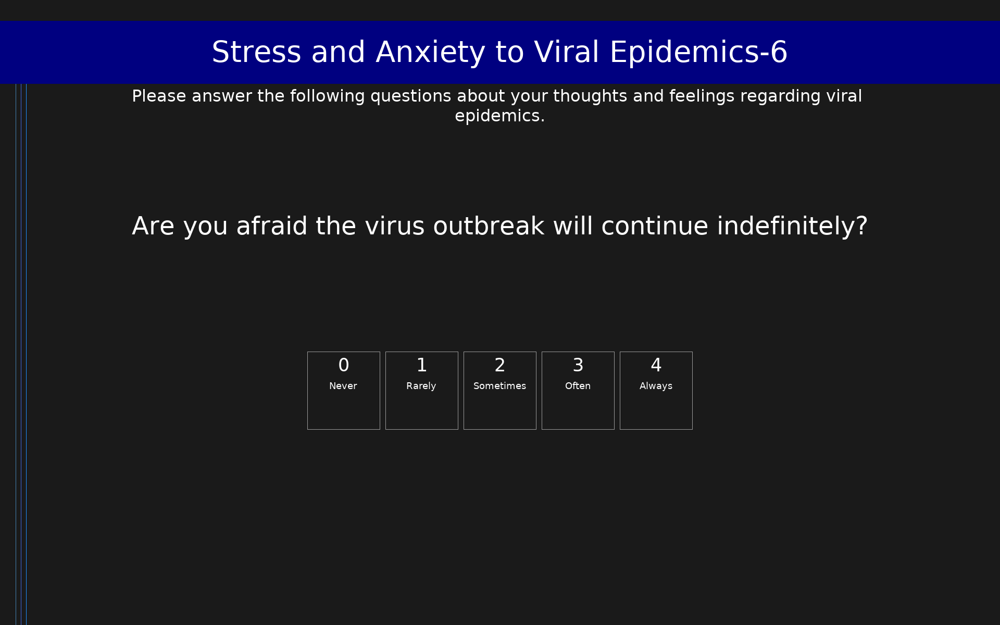

# Stress and Anxiety to Viral Epidemics-6 (SAVE-6)

6-item measure assessing anxiety response to viral epidemic threats, covering fear of contagion, health worry, and avoidance concerns. Scores range from 0 to 24.

## Overview

- **Code:** `SAVE6`
- **Items:** 0
- **Languages:** en
- **Version:** 1.0
- **License:** CC BY 4.0

## Dimensions

| ID | Name | Description |
|----|------|-------------|
| `anxiety` | Viral Epidemic Anxiety | Overall anxiety response to viral epidemic threats. Higher scores indicate greater anxiety. |

## Questions

## Scoring

- **anxiety**: sum_coded (6 items)
  - Sum of all 6 items (0-24). Severity: 0-6 minimal, 7-12 mild, 13-18 moderate, 19-24 severe.

## Citation

Chung, S., Kim, H. J., Ahn, M. H., Yeo, S., Kim, K., Jeong, J., Lee, J., & Suh, S. (2021). Development of the Stress and Anxiety to Viral Epidemics-6 items (SAVE-6) scale for assessing the anxiety response of the general population to the viral epidemic during the COVID-19 pandemic. Frontiers in Psychology, 12, 669606. https://doi.org/10.3389/fpsyg.2021.669606

**URL:** https://doi.org/10.3389/fpsyg.2021.669606

## Files

- `SAVE6.en.json`
- `SAVE6.json`
- `screenshot.png`

---
*This README was auto-generated by `tools/generate_readmes.py`.*
