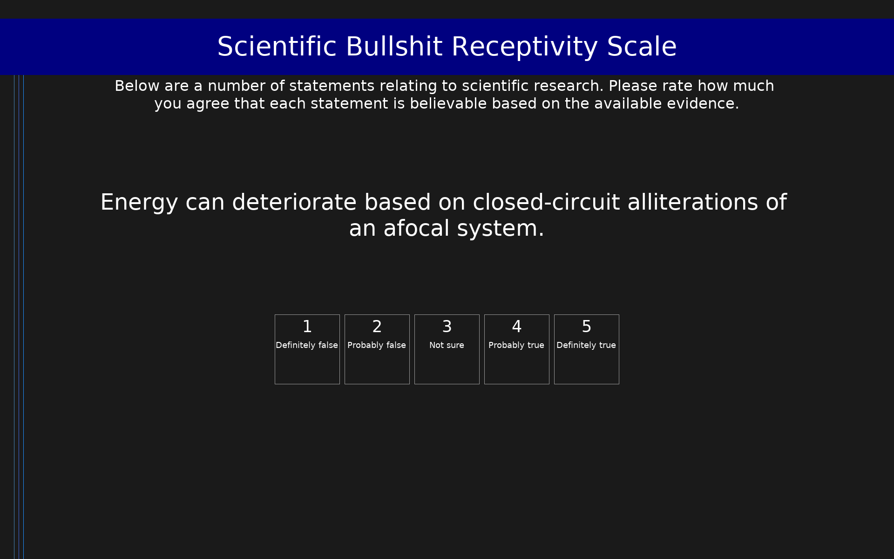

# Scientific Bullshit Receptivity Scale (SBR)

20-item scale measuring receptivity to scientific bullshit. Ten items are plausible-sounding but scientifically nonsensical statements (bullshit items, dimension: sbr) created by taking existing physical laws and replacing central words with randomly selected physics glossary terms. Ten items are real scientific statements based on actual physical laws (dimension: factual). Participants rate how truthful each statement is on a 5-point scale (1 = Not at all truthful; 5 = Very truthful). The primary score is the mean rating of the 10 scientific bullshit items (alpha = .83); higher scores indicate greater receptivity to scientific bullshit. Note: the factual items were included in Studies 1 and 2 only, not Study 3.

## Overview

- **Code:** `SBR`
- **Items:** 0
- **Languages:** en
- **Version:** 1.0
- **License:** CC BY 4.0

## Dimensions

| ID | Name | Description |
|----|------|-------------|
| `sbr` | Scientific Bullshit Receptivity |  |
| `factual` | Factual Science Ratings |  |

## Questions

## Scoring

- **sbr**: mean_coded (10 items)
  - Mean of 10 scientific bullshit items (range 1-5). Higher scores indicate greater receptivity to scientific bullshit (alpha = .83).
- **factual**: mean_coded (10 items)
  - Mean of 10 real scientific statements (range 1-5). Used as a comparison/control measure. Higher scores indicate greater acceptance of true scientific facts. Note: factual items were excluded from Study 3.

## Citation

Evans, A. M., Sleegers, W., & Mlakar, Z. (2020). Individual differences in receptivity to scientific bullshit. Judgment and Decision Making, 15(3), 401-412.

**URL:** https://doi.org/10.1017/S1930297500007191

## Files

- `SBR.en.json`
- `SBR.json`
- `screenshot.png`

---
*This README was auto-generated by `tools/generate_readmes.py`.*
